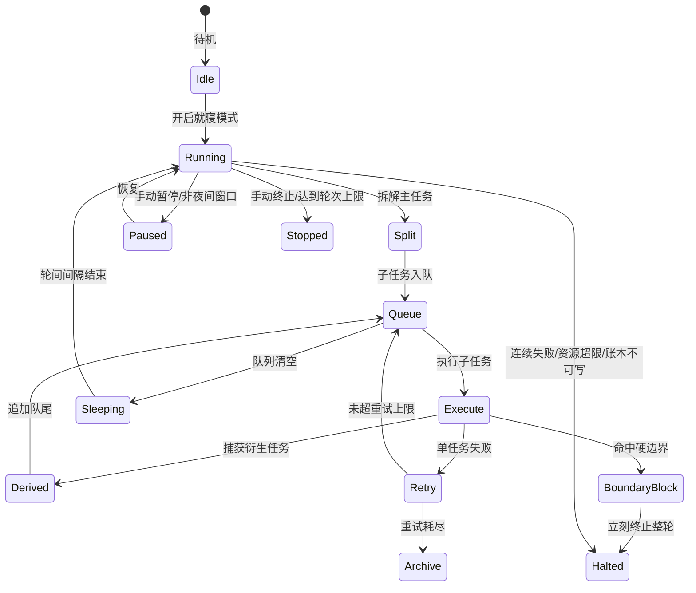

# HERMES 就寝无人值守循环执行引擎

状态：v0.1 本地离线可运行版
入口：`GET/POST /sleep-loop?action=...`
核心模块：`shared/sleep_loop_engine.py`
常驻 worker：`scripts/sleep_loop_worker.py`
PM2：`ecosystem.config.cjs`
前端面板：`index.html`

## 1. 工程定位

本轮按用户夜间就寝场景实现：用户休息后，HERMES 在后台静默执行任务池，自动拆解、入队、执行、捕获衍生任务、循环续跑，并在次日提供本地账本与日志复盘。

当前仓库主运行时是 Python/FastAPI + SQLite，因此第一版采用：

- 持久化：SQLite 本地账本；表结构兼容后续迁移 MySQL。
- 队列：数据库状态队列；字段边界兼容后续 Redis 待执行/执行中/完成队列。
- 常驻：Python worker + PM2 配置。
- 面板：静态 `index.html` 轮询 FastAPI。
- 通知：就寝模式不弹窗、不语音、不外发第三方通知，只写本地日志。

## 2. 默认边界

| 边界 | 默认值 | 锁死上限 |
| --- | ---: | ---: |
| 单轮拆解任务 | 20 | 50 |
| 种子任务重复循环 | 默认关闭 | 需显式 `repeat_seed_tasks=true` |
| 全局待执行+执行中队列 | 200 | 200 |
| 单任务衍生任务追加 | 8 | 8 |
| 单任务重试 | 3 | 3 |
| 并发配置 | 4 | 4 |
| 单任务超时 | 120s | 120s |
| 空闲轮询 | 30s | 24h |
| HTTP 每分钟 | 30 | 30 |
| 连续失败熔断 | 10 | 10 |
| 单次批量文件 | 50 | 50 |
| 单日志文件 | 200MB | 200MB |
| 最大连续运行 | 12h | 12h |
| 真实任务校验 | 强制开启 | 不可关闭 |

### 真实任务硬约束

睡觉循环的 `done` 不等于“账本写入成功”，只代表真实工具执行并返回了可核验证据。默认禁止以下任务冒充完成：

- `echo` 心跳/占位任务。
- `context_pack_build` 纯上下文包构建。
- `taskpack_generate` 任务包预览，尤其是 `dry_run=true`。
- 任意 `dry_run=true` 结果。

允许自动入队并计入完成的真实执行器：

| 执行器 | 完成证据 |
| --- | --- |
| `file_read` | 返回 `path` + `content` |
| `safe_write` | `dry_run=false` 且返回 `written=true` + `path` |
| `kb_search` | 返回 `items` 列表 + `count` 数值 |
| `mk_search` | 返回 `items` 列表 + `count` 数值 |

默认自然语言拆解任务会落成 `kb_search`，不会再生成 `echo`。如果执行器缺少证据，即使工具返回成功，也会转为失败/重试/归档，不能记入 `done`。

## 3. 数据表 SQL

由 `init_sleep_loop_schema()` 自动创建：

```sql
CREATE TABLE IF NOT EXISTS sleep_loop_runs (
    id TEXT PRIMARY KEY,
    status TEXT NOT NULL DEFAULT 'idle',
    goal TEXT NOT NULL DEFAULT '',
    cycle_no INTEGER NOT NULL DEFAULT 0,
    failure_streak INTEGER NOT NULL DEFAULT 0,
    next_cycle_at TEXT,
    started_at TEXT NOT NULL,
    updated_at TEXT NOT NULL,
    stopped_at TEXT,
    stop_reason TEXT NOT NULL DEFAULT '',
    config_json TEXT NOT NULL DEFAULT '{}',
    seed_tasks_json TEXT NOT NULL DEFAULT '[]'
);

CREATE TABLE IF NOT EXISTS sleep_loop_tasks (
    id TEXT PRIMARY KEY,
    run_id TEXT NOT NULL,
    parent_id TEXT NOT NULL DEFAULT '',
    cycle_no INTEGER NOT NULL DEFAULT 0,
    title TEXT NOT NULL,
    content TEXT NOT NULL,
    status TEXT NOT NULL DEFAULT 'pending',
    priority INTEGER NOT NULL DEFAULT 100,
    executor TEXT NOT NULL DEFAULT 'kb_search',
    payload_json TEXT NOT NULL DEFAULT '{}',
    dependencies_json TEXT NOT NULL DEFAULT '[]',
    retries INTEGER NOT NULL DEFAULT 0,
    max_retries INTEGER NOT NULL DEFAULT 3,
    derived_count INTEGER NOT NULL DEFAULT 0,
    risk_level TEXT NOT NULL DEFAULT 'low',
    result_json TEXT NOT NULL DEFAULT '{}',
    error TEXT NOT NULL DEFAULT '',
    created_at TEXT NOT NULL,
    started_at TEXT,
    finished_at TEXT
);

CREATE TABLE IF NOT EXISTS sleep_loop_events (
    id TEXT PRIMARY KEY,
    run_id TEXT NOT NULL DEFAULT '',
    task_id TEXT NOT NULL DEFAULT '',
    level TEXT NOT NULL DEFAULT 'info',
    event_type TEXT NOT NULL,
    message TEXT NOT NULL,
    metadata_json TEXT NOT NULL DEFAULT '{}',
    created_at TEXT NOT NULL
);
```

## 4. 状态机



## 5. API

为避免继续扩散接口，使用复合端点：

```text
GET  /sleep-loop?action=status
GET  /sleep-loop?action=tasks&status_filter=pending&limit=100
GET  /sleep-loop?action=logs&limit=100
GET  /sleep-loop?action=config
GET  /sleep-loop?action=architecture

POST /sleep-loop?action=start
POST /sleep-loop?action=stop
POST /sleep-loop?action=pause
POST /sleep-loop?action=resume
POST /sleep-loop?action=tick
POST /sleep-loop?action=config
```

示例：

```bash
curl -X POST 'http://127.0.0.1:8000/sleep-loop?action=start' \
  -H 'Content-Type: application/json' \
  -H 'X-API-Key: <your-local-api-key>' \
  -d '{"goal":"整理项目状态；运行本地测试；生成复盘日志","config":{"max_split_tasks":20,"repeat_seed_tasks":false}}'
```

## 6. PM2

```bash
pm2 start ecosystem.config.cjs --only cognitive-loop-os-api
pm2 start ecosystem.config.cjs --only hermes-sleep-loop-worker
pm2 logs hermes-sleep-loop-worker
pm2 stop hermes-sleep-loop-worker
```

## 7. 验证命令

```bash
python -m pytest tests/test_sleep_loop_engine.py -q --tb=short
python -m pytest tests -q --tb=short
cd knowledge_base && python -m pytest tests -q --tb=short
python -m ruff check shared/sleep_loop_engine.py scripts/sleep_loop_worker.py tests/test_sleep_loop_engine.py --select E,F,B
```

## 8. 当前限制

- 当前执行器只允许真实可核验工具自动计入完成：`file_read/safe_write/kb_search/mk_search`。`echo/context_pack_build/taskpack_generate` 被视为心跳、上下文构建或预览任务，默认阻断，不允许冒充完成。
- 第一版没有直接引入 Redis/MySQL，避免增加部署阻塞；表结构已经为后续迁移保留队列状态与账本边界。
- CPU/内存阈值已通过可选 `psutil` 采样接入：CPU 超阈进入冷却，内存超阈先 GC，仍超则熔断；后续可再扩展为持续 60s/10min 滑动窗口统计。
- 为避免“完成数虚高”，默认队列清空后即 `queue_completed` 停止；只有前端/调用方显式设置 `repeat_seed_tasks=true` 时才会重复种子任务。
