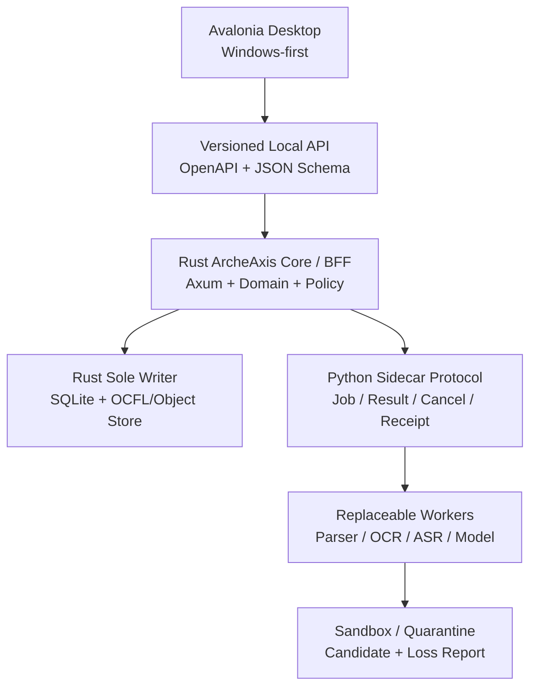
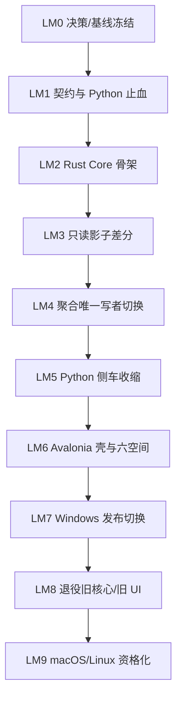

# ArcheAxis Knowledge 完整修复、仓库规范与语言迁移总任务包

> 版本：v2.2（项目用途与许可边界纠正版）  
> 日期：2026-09-04  
> 唯一仓库：`DTALEX66/ArcheAxis-Knowledge-OS`  
> 当前云端基线：`main@ce3c2de551bcaac52c8a26d012e6482c1a73a540`  
> 当前公开 Release：`v0.6.14`，源提交 `c202c5b5a4789f0dc21accaa7ccbfed4676f0573`  
> 任务性质：修复与迁移规划；本文不授权修改、删除、提交、推送、合并或发布。  
> 当前裁决：`NO-GO`。在 P0 清零、精确 SHA 全资格化和 Windows 产品路径验收前，不得发布。
> 历史来源权威：`ARCHEAXIS-HISTORY-AUTHORITY-AND-SOURCE-REGISTRY-2026-09-04.md`。本任务包不得脱离该总账被单独当作完整历史。
> Owner 项目定位：ArcheAxis 是个人研究项目，当前按非商业目的开发和使用；这是项目用途说明，不是许可限制或重许可决定。仓库现行第一方许可继续为 MIT。

> **历史执行段落已废止：** 本文仍是问题、风险与证据清单，但其中
> “Rust 在 legacy DB 上逐聚合接管 writer”、旧 G0 开工顺序、旧 task/lease
> 协议以及 WORK-LAB/DESIGN-LAB candidate 联动均不得执行。当前方案采用
> legacy Python 独占旧库、Rust 独占隔离 vNext 新库、单向导入，且两外部
> LAB 不作为依赖。唯一执行入口是包根 MASTER、Program graph 和 repo-seed。

---

## 0. 本任务包如何裁决历史冲突

### 0.1 权威优先级

发生冲突时严格按以下顺序裁决：

1. 用户最新明确决定；
2. 当前云端源码、配置、测试和可复现运行证据；
3. 当前 exact-SHA CI、Release、安装态或回读收据；
4. 当前项目合同、Decision/Supersession Ledger；
5. 旧交接、旧任务包、旧 README 和历史对话。

本次已按历史总账重新盘点当前可访问资料：五组直接别名命中 85 项，三项目/仓库联动命中 13 项，去重后 97 项唯一来源资产、64 项决策承载物；不是只读了 9 月 3 日 handoff。20MB 对话归档止于 8 月 25 日，8 月 26 日至 9 月 4 日的覆盖接缝由后续专项任务包、仓库权威索引和 Owner 本轮裁决补齐。未来新增资料必须追加到总账后再裁决。

因此：

- 2026-08-14/19 归档中的 Python 领域后端 + React/Tauri 是历史实现起点；
- 2026-09-01《从零语言架构审计与逐步迁移任务包》明确裁决 **Rust 为权威核心、Python 为 AI/解析侧车**；
- 2026-09-03 交接又明确 **Windows-first、C# + Avalonia UI、独立本地服务、未来 macOS/Linux**，但把“UI 不再以 Rust/Tauri 为主线”错误扩写成了“Python 继续拥有领域/数据服务”，与 9 月 1 日专项语言裁决冲突；
- 2026-09-04 Owner 再次确认“核心是 Rust”。本任务包据此合并两项有效决策：**C#/Avalonia 管桌面体验，Rust 管权威真值，Python 管成熟 AI/解析生态**；
- Tauri/Rust 组合不再是桌面 UI 主线，但 Rust Core 不是 sunset 对象；进入 sunset 的是 Tauri host 与 React 产品表面；
- 迁移采用按聚合切换唯一写者的可回滚绞杀模式，不建立长期第三套 UI，也不允许 Rust/Python 双写。

### 0.2 永久不变的产品边界

- 对外产品：`ArcheAxis Knowledge｜星环知识平台`；
- 内部工作台：`ArcheAxis Learning Workspace`；
- 技术 ID：`archeaxis-workspace`；仓库名保持 `ArcheAxis-Knowledge-OS`；
- ArcheAxis 是人类与 AI 双主体的重型学习、可信知识与证据 OS，不是 RAG 壳、聊天页或通用 Agent OS；
- 核心链：`Source → Anchor → Evidence/Provenance → Learning Event → Human Mastery → Machine Competence Candidate → Review → Verified/Revoked`；
- WORK-LAB、DESIGN-LAB、ArcheAxis 是三个独立仓库、独立数据库、独立 CI/Release 和独立回滚链；
- WORK-LAB 只拥有 Action Authority，DESIGN-LAB 只拥有 Design Authority，ArcheAxis 只拥有 Knowledge Authority；
- 原件、客户数据、密钥、运行缓存、模型缓存和生成物不得进入 Git；
- UI、插件、外部 Tutor、模型和解析器不得直接决定可信知识、掌握度或机器能力事实。
- 项目由 Owner 作为个人研究、非商业项目开发和使用；该项目定位不得被写成“仅授权个人非商业使用”。第一方代码继续遵守仓库现行 MIT 许可，第三方组件继续遵守各自许可证。

### 0.3 最新云端对语言路线的直接证据

`main@ce3c2de` 的 `docs/LANGUAGE_BOUNDARY_AUTHORITY_INDEX.md` 已把语言迁移顺序写成当前权威：

1. 现时产品真值 writer 仍是 `app/` 下 Python 命令路径；
2. 先关闭 G0 证据缺口；
3. 再建立 Rust 只读差分消费者；
4. 连续取得两份零语义差分收据后，才允许一次切换一个聚合；
5. 禁止 Rust/Python 双写，禁止以编译成功冒充迁移完成。

同一 SHA 的实际 `src-tauri/Cargo.toml` 仍只有 `archeaxis-desktop` Tauri host；默认分支未发现目标 `archeaxis-core/archeaxis-domain/Axum` 实现，也未发现 `.cs/.csproj/.sln` Avalonia 工程。因此：**Rust Core 是已纳入仓库治理的目标路线，但尚未成为当前实现；Avalonia 是 Owner 确认的目标 UI，也尚未落地。** 本任务包不能把目标写成“已经完成”。

同一 SHA 的 `docs/current/CURRENT_REALITY_2026-09-01.md` 标注“refreshed 2026-09-04”，但仍把 canonical branch 写为父提交 `af216e3`；实际默认分支已是 `ce3c2de`。因此文档路径和日期正确也不能证明事实新鲜，必须把“被审计 SHA、承载该记录的 SHA、观察时间”分开。

---

## 1. 当前事实与最终目标

| 维度 | 当前 `main@ce3c2de` | 最终目标 | 当前状态 |
|---|---|---|---|
| 桌面 UI | React/Vite + root Rust/Tauri；另有 recovery Tauri | C# + Avalonia 单一桌面 UI/Supervisor | `BLOCKED` |
| 权威核心 | Python 模块化单体；Rust 目前仅 Tauri/恢复边界 | Rust `archeaxis-core` + Axum BFF，按聚合接管真值 | `NOT_STARTED` |
| Python 运行时 | 同时承担领域真值、API、解析和 AI | 仅可替换解析/AI/研究/评测 sidecars | `MIGRATION_REQUIRED` |
| 数据写入 | 多处直接 SQLite 连接，writer 分散 | 所有核心聚合单一 writer，只经服务命令写入 | `FAIL` |
| 核心 V2 对象 | Source/Anchor/Learning/Receipt 组件和单测存在 | 生产 Golden Path 全链接通 | `PARTIAL/E2` |
| UI 合同 | 文档六空间、配置七 surface、代码九空间 | 冻结六空间合同及二级导航 | `FAIL` |
| 开发数据根 | `.hermes/` | `.project-local/` | `CONFLICT` |
| 安装数据根 | `%LOCALAPPDATA%\ArcheAxis\Workspace` | 保持 | `KEEP` |
| API 安全 | desktop auth 默认关闭；写入保护不完整 | 所有产品 API 会话认证；所有 mutation scope + idempotency | `FAIL` |
| DeepTutor | 顶层字段阻断，嵌套 outcome 可影响 M5-M7 | 只提交原始观测候选，服务端派生掌握回执 | `FAIL` |
| 多格式链 | 锁定 Linux 环境存在 Magika/MarkItDown 失败 | 每个平台锁定模型、引擎、格式矩阵均可回放 | `FAIL` |
| CI | 当前 HEAD 仅选择性 `a0-gates` 通过 | 分层快速 CI + exact-SHA stage/RC 全资格化 | `PARTIAL` |
| Release | `v0.6.14` 有 9 个资产；当前 main 未发布 | 新版本完整签名、SBOM、安装态、下载回读 | `KEEP + PENDING` |
| 项目定位与许可 | Owner 将项目用于个人研究和非商业目的；root `LICENSE`、`pyproject.toml`、`THIRD_PARTY_NOTICES.md` 当前为 MIT | README 准确并列“个人研究/非商业项目用途”与“MIT 软件许可”，不得把用途说明改写成下游使用限制；第三方原许可不变 | `KEEP + WORDING_FIX` |

### 1.1 已修复且必须锁回归的事项

以下不应重复推倒，只需保留回归测试：

- Machine Mastery 增加 `NONE` 前置状态，旧 off-by-one 已纠正；
- Source/Learning 关键路径不再使用不兼容的 `sqlite3.Row.get()`；
- Human Learning 不再自动生成 Verified Machine Knowledge，而是进入未验证候选；
- `main`、`v*` 标签保护规则集已经启用且无 bypass；
- `v0.6.14` Release 的 Setup、Green、Portable、wheel、manifest、identity、SBOM、notices、checksums 作为历史不可变证据保留；
- 前端现有 119 项测试和 Vite production build 可作为 Avalonia 行为迁移参考，不能当 Avalonia 完成证据。

---

## 2. 目标系统架构



### 2.1 语言责任

| 层 | 目标语言/技术 | 责任 | 禁止事项 |
|---|---|---|---|
| 桌面客户端 | C#、.NET 10 LTS、Avalonia 12 | UI、窗口、快捷键、文件选择、Supervisor、更新与恢复 | 不直接访问 SQLite；不内置领域真值；不复制 Core 状态机 |
| 权威核心/BFF | Rust、Tokio、Axum/Tower | Source/Anchor/Evidence/Learning/Competence 状态机、权限、事务、审计、迁移、恢复、作业编排、唯一写入 | 不自研 OCR/ASR/通用解析/模型；不依赖 Avalonia |
| Python 侧车 | Python 3.12 基准，兼容 3.11/3.13 | Docling、MarkItDown、OCR、ASR、模型、研究提取、评测候选 | 不直接写权威表；不决定 Verified/Mastery/Competence；不拥有 migration |
| 契约 | OpenAPI、JSON Schema、事件 schema；未来可评估 WIT | Rust server、C# client、Python worker 三端生成和兼容验证 | 不手写三份漂移 DTO |
| 存储 | SQLite WAL + 内容寻址原件/OCFL export；Projection 可替换 | Rust Core 拥有事务真值、版本、备份、恢复、导出 | UI、插件、Python sidecar 无数据库句柄 |
| 旧产品面 | React + Tauri | 仅作迁移期行为基准、兼容入口和回滚产品 | 不新增产品域；两个稳定 Avalonia Release 后退出生产 |

### 2.2 独立本地服务定义

`archeaxis-local-service` 是 Rust Core/BFF 的可执行服务身份，必须同时满足：

- 可由 Avalonia Supervisor 启动，也可从 CLI 独立启动；
- 只监听 loopback，随机端口；
- 一次启动一个 256-bit 内存 launch token；
- 通过握手返回 product ID、API major、service version、source commit、schema、runtime mode、workspace ID、capabilities；
- Windows 使用 Job Object + `CREATE_NO_WINDOW`，退出客户端后清理子进程，不弹终端；
- macOS/Linux 使用等价 process group/child lifecycle；
- 服务崩溃时 Avalonia Recovery Surface 仍可启动、查看脱敏日志、切换数据模式、重试和恢复；
- bundled、green、portable、external-dev 的 runtime identity 与数据策略完全分开；
- Python worker 由 Core 通过版本化 sidecar protocol 按任务启动，只有显式输入和受控输出目录，无全库读取与数据库写权限；
- Core 在无 Python sidecar 时仍能浏览、验证、导出和恢复已有知识；缺失的解析/AI 能力必须显示 `UNAVAILABLE/DEGRADED`。

### 2.3 官方资料复核后的技术选型

本轮外部调研只把官方规范、官方文档、上游项目仓库作为工程事实源；社区文章只可用于发现候选，不能成为依赖采纳依据。

| 责任面 | 采用 | 关键实现约束 | 不采用/暂缓 |
|---|---|---|---|
| Rust HTTP/BFF | `axum` + `tower`/`tower-http` | policy、auth、timeout、trace、request ID、body limit 在 Tower 层组合；领域层不知道 HTTP | 自建 middleware 框架；把 Tauri command 当长期 API |
| SQLite | `rusqlite` + 单写者 actor/专用线程 | 写入串行；读连接严格 read-only；`foreign_keys=ON`、WAL、busy timeout、事务/outbox；异步边界用受控 blocking task | writer 连接池；Python/Rust 双写；为桌面单机先引入分布式数据库 |
| 备份 | SQLite Online Backup API + 逻辑指纹 | 活库备份不用直接复制 `.sqlite/-wal/-shm`；备份后独立打开、完整性检查、schema 与聚合指纹回读 | 文件系统裸拷贝活库；把 WAL checkpoint 当备份 |
| API 契约 | OpenAPI + JSON Schema 2020-12 | contract package 是唯一事实；严格 unknown-field；兼容 diff；fixtures 双向 round-trip | Rust/C#/Python/React 各手写 DTO |
| C# client | Microsoft Kiota 生成 | 锁 generator/version/config；生成代码不可手改；鉴权/重试/trace 用 adapter 注入 | 手写 REST client；UI view model 直接拼 URL |
| Avalonia | Avalonia 12 + .NET 10 LTS | Generic Host、Microsoft DI、CommunityToolkit.Mvvm；Windows-first；保持可跨平台但不提前承诺支持 | 自制 IOC/MVVM 基础设施；继续扩建 React/Tauri 产品面 |
| Avalonia 测试 | headless + Appium 双层 | headless 覆盖树、布局、样式、binding、输入；Appium/真实窗口覆盖 DPI、读屏、焦点、文件选择、启动/恢复 | 只跑 headless 就宣称桌面可用；只做截图 diff |
| Python worker | 独立进程、版本化 manifest/result/cancel/receipt | 初期优先 stdio NDJSON；大文件只传只读句柄/受控路径；Core 校验 hash/schema/size/time；worker 无 DB/全库权限 | 初期 PyO3 内嵌解释器；默认部署 Docling Serve/容器；worker 自启 HTTP 公网服务 |
| 文档解析 | Docling 主结构解析；MarkItDown 轻量 fallback | 原件、结构树、页/段/table anchor、loss report 都保留；Markdown 只做 projection | 将 Markdown 当唯一 canonical；每种 Office/PDF 自研解析器 |
| OCR | RapidOCR 离线主适配器；Tesseract fallback | 引擎、模型、语言包、binary 来源、许可与 hash 进入 capability manifest；低置信输出进 review | 静默下载模型；把 OCR 文本当已验证原文 |
| ASR | `faster-whisper` adapter | 锁 CTranslate2/CUDA/模型组合；CPU/GPU 分开资格化；保留时间戳、置信与 loss | 将 GPU 可用性假设写死；自动把转写升级为 Evidence |
| 间隔复习 | Rust `fsrs-rs` | 调度参数、库版本、训练数据 provenance 可回读；只负责 schedule，不替代 M0-M7 MasteryReceipt | 用 FSRS 难度/稳定性充当掌握度真值 |
| 注释/溯源 | 内部模型映射 W3C Web Annotation + PROV-O | 导出时可互操作；内部不强制 JSON-LD/RDF runtime | 近期引入图数据库/RDF store 只为“标准化” |
| 长期存档 | 内容寻址原件 + OCFL 1.1 export/validator profile | 先做可验证导出、版本清单和重建性；稳定后再评估完整 store layout | 迁移期强制全库重写为 OCFL |
| 插件 | 未来 WASI/Component Model | Core 稳定、权限模型/资源配额/签名/撤销完成后再启用；WIT 契约独立版本 | 近期 Marketplace；插件直接写 SQLite；长期加载任意 Python 包 |
| Windows 打包 | Velopack 候选 + Authenticode | Setup 默认 per-user；企业 MSI 按需；`current` 会整体替换，因此数据/日志/模型必须在外部稳定目录；Green/Portable 更新策略单独定义 | 把用户数据放安装目录；未安装态假装完成 updater E2E |

### 2.4 关键实现细化

#### Rust 存储与事务

- 建立 `WriterActor`：唯一持有 read-write `rusqlite::Connection`，接收 typed command，不接受 SQL string；
- 每条 command 在一个事务中写 aggregate、append event、idempotency ledger、outbox 和 audit receipt；
- 所有更新使用 `expected_revision`；冲突返回结构化 `409 revision_conflict`，禁止 last-write-wins；
- 查询侧可有小型 read-only pool，但连接 URI 必须 `mode=ro`，并由测试证明 write pragma/DDL/DML 均失败；
- migration binary 与 runtime writer 互斥，持有 schema lease；应用启动只验证 schema，不隐式变更；
- 在线备份输出到新文件，经 `PRAGMA integrity_check`、schema manifest、aggregate counts/hash、随机抽样 readback 后才可登记为 restore point；
- 每次 cutover 的 writer lease 同时绑定 `aggregate/schema/api/source_sha`，回滚必须检查旧 writer 能解释新写入，否则只能前滚修复。

#### 本地 API 与 supervisor 安全

- Core 只绑定 IP literal `127.0.0.1`，需要 IPv6 时另绑定 `[::1]`；不绑定 `0.0.0.0`，不依赖 `localhost` 解析；
- 随机端口和 256-bit launch secret 由 supervisor 创建，通过继承 pipe/stdin/受限句柄传递，不放命令行、日志、URL、磁盘配置或环境诊断 dump；
- bootstrap 只返回非敏感 identity；业务请求使用 bearer/session proof、scope、request ID、幂等键；所有 sensitive response `Cache-Control: no-store`；
- 校验 `Host`、peer loopback、body/content-type、Origin（迁移期 WebView）和 token；CORS 不是认证，rate limit 也不是认证；
- Windows 将 Core 及其 Python worker 放入 Job Object，并启用 `JOB_OBJECT_LIMIT_KILL_ON_JOB_CLOSE`；同时设置内存/CPU/进程数/超时和 output-size 限额；
- 正常取消走协议，超时先 graceful terminate，再 hard kill；Core 必须把 `CANCELLED/TIMED_OUT/KILLED` 写入 job receipt，不能留下成功假象。

#### Python sidecar 协议

```json
{
  "protocol": "archeaxis.sidecar.job.v1",
  "job_id": "uuid",
  "capability": "document.parse",
  "input": {"sha256": "…", "media_type": "application/pdf", "handle": "…"},
  "limits": {"deadline_ms": 120000, "max_output_bytes": 52428800},
  "requested_outputs": ["structure", "anchors", "loss_report"]
}
```

返回必须包含：`status`、input/output hash、worker/package/model identity、schema version、warnings/losses、耗时和资源观测。Core 只接受与 job manifest 精确绑定的结果；任何 `verified/mastery/competence/approval` 字段均 schema reject。

#### 桌面与打包

- 目标基线锁为 .NET 10 LTS + Avalonia 12；每月更新受支持 patch，不锁死首发 patch；
- 用 .NET Generic Host 管理 DI、配置、日志和 lifetime；CommunityToolkit.Mvvm 提供 observable/command，避免自建框架；
- UI 仅消费 generated Kiota client 和 typed event stream；domain model 不进入 view model assembly；
- fast test 用 Avalonia headless；Windows release gate 必须运行 Appium/真实窗口，覆盖 100/125/150/200% DPI、键盘、Narrator、IME、断网、Core 崩溃与恢复；
- Velopack `current` 目录会被升级整体替换：数据库、用户资料、日志、模型包、restore points 均不得置于 `current`；Setup/Green/Portable 的数据根和更新策略分别测试；
- 所有 exe/dll/native binary/worker package/model manifest 生成统一 component manifest，签名并写入 SBOM/NOTICE；运行时握手回报同一 source SHA 和 component set hash。

### 2.5 明确拒绝或延后的“看起来先进”方案

| 方案 | 裁决 | 原因/重新评估条件 |
|---|---|---|
| 全 Rust 重写 OCR/ASR/Office/PDF/模型生态 | 拒绝 | 成本高且降低格式覆盖；保留 Python sidecar 边界即可获得 Rust 真值安全 |
| Docling Serve 容器作为默认桌面依赖 | 拒绝默认 | 镜像/运行成本和部署面过大；只有远程/多用户服务形态才重评 |
| PyO3 把 Python 嵌入 Core | 延后 | 增加崩溃、GIL、ABI、打包和权限耦合；进程协议稳定并有明确性能瓶颈后再评估 |
| SQLx/异步连接池作为 SQLite writer | 不作为默认 | 与单机 sole-writer 目标冲突；若未来只读吞吐被实测证明为瓶颈，可在查询侧评估 |
| Qdrant/Neo4j/Postgres/Kafka 进入当前闭环 | 拒绝 | 当前单机、local-first、可恢复性优先；只有 SQLite/object store 指标失败且有可重现基准才立项 |
| 全量 RDF/JSON-LD 内部模型 | 拒绝 | 使用 W3C 语义映射与导出即可；不把互操作标准变成运行时复杂度 |
| 先做 WASI Marketplace | 延后 | Core、权限、签名、资源配额、撤销和供应链未稳定 |
| React/Tauri 与 Avalonia 长期双主线 | 拒绝 | 只允许迁移期行为 oracle/回滚；两个稳定 Avalonia+Rust Release 后退出活跃面 |

### 2.6 性能与资源预算

先在固定 Windows reference machine 建立基线，随后把以下作为首轮 SLO；达不到时优化实现，不降低证据语义：

| 场景 | 首轮门槛 |
|---|---|
| Avalonia 到 Recovery 可交互 | cold start p95 ≤ 2.5 s；Core 未就绪也能显示真实状态 |
| Core health/identity handshake | p95 ≤ 500 ms；失败 2 s 内给出可操作原因 |
| 本地简单读 API | 100k Source workspace 下 p95 ≤ 100 ms |
| 简单 command acknowledgement | 不含长 sidecar job，p95 ≤ 250 ms，且 durability 已落盘 |
| UI 输入/导航 | 交互 p95 ≤ 100 ms；长列表虚拟化；无主线程解析/DB/网络阻塞 |
| sidecar 取消 | 2 s 内 graceful；5 s 内 hard stop 并产出终态 receipt |
| idle 资源 | 分别记录 UI/Core/worker RSS、handles、threads；相对已接受基线回退 >10% 阻断 RC |
| 大文件 | 流式/hash 一次；不把完整原件经 JSON/base64 复制多次；内存峰值由 fixture size budget 限制 |

### 2.7 官方来源快照（检索于 2026-09-04）

- Axum/Tower：<https://docs.rs/axum/latest/axum/>、<https://docs.rs/axum/latest/axum/middleware/index.html>、<https://docs.rs/tower-http/latest/tower_http/trace/index.html>
- Rust SQLite 与备份：<https://github.com/rusqlite/rusqlite>、<https://www.sqlite.org/wal.html>、<https://www.sqlite.org/backup.html>
- 契约与生成：<https://github.com/OAI/OpenAPI-Specification>、<https://json-schema.org/draft/2020-12>、<https://learn.microsoft.com/en-us/openapi/kiota/>
- Avalonia 与 .NET：<https://docs.avaloniaui.net/docs/avalonia12-breaking-changes>、<https://docs.avaloniaui.net/docs/testing/setting-up-the-headless-platform>、<https://docs.avaloniaui.net/docs/testing/ui-testing-with-appium>、<https://dotnet.microsoft.com/en-us/platform/support/policy/dotnet-core>、<https://learn.microsoft.com/en-us/dotnet/core/extensions/generic-host>
- Windows 生命周期与安装：<https://learn.microsoft.com/en-us/windows/win32/procthread/job-objects>、<https://docs.velopack.io/packaging/operating-systems/windows>、<https://docs.velopack.io/packaging/installer>
- 原生应用 loopback：<https://www.rfc-editor.org/rfc/rfc8252>
- 解析/OCR/ASR/学习：<https://github.com/docling-project/docling>、<https://github.com/microsoft/markitdown>、<https://github.com/RapidAI/RapidOCR>、<https://github.com/tesseract-ocr/tesseract>、<https://github.com/SYSTRAN/faster-whisper>、<https://github.com/open-spaced-repetition/fsrs-rs>
- 互操作/存档：<https://www.w3.org/TR/annotation-model/>、<https://www.w3.org/TR/prov-o/>、<https://ocfl.io/1.1/spec/>、<https://component-model.bytecodealliance.org/language-support/building-a-simple-component/rust.html>
- 供应链：<https://docs.github.com/en/actions/concepts/security/artifact-attestations>、<https://docs.github.com/code-security/supply-chain-security/understanding-your-software-supply-chain/about-dependency-review>、<https://github.com/rustsec/rustsec>、<https://github.com/EmbarkStudios/cargo-deny>、<https://github.com/pypa/pip-audit>、<https://github.com/gitleaks/gitleaks>
- 许可与仓库标注：<https://opensource.org/license/mit>、<https://docs.github.com/articles/licensing-a-repository>

---

## 3. P0 安全与真值修复

### AXR-P0-AUTH-001｜统一产品 API 认证

**问题**：`auth.enabled=false` 时全局匿名身份被放行；Knowledge Base 挂载应用可从 `Origin:null` 匿名写入。Workspace 只有部分 mutation 使用桌面 token。

**实施**：

1. 先在现行 Python API 新建统一 `LocalSessionAuthMiddleware` 立即止血；Rust BFF 接管路由时以同一攻击用例逐项重放，未通过不得切换；
2. 最终在 Rust/Tower policy layer 统一覆盖 Core、KB、Capability、Federation、Learning、Workspace、PDF、SSE、下载和恢复接口；
3. 公开 allowlist 只保留最小 `/health/bootstrap` 与不含敏感信息的版本探针；
4. `/api/v1/**` 默认需要 launch token；所有 POST/PUT/PATCH/DELETE 默认需要 scope；
5. mutation 必须携带 `Idempotency-Key`，由 Core ledger 绑定请求摘要和结果；
6. `desktop` profile 不再通过 `auth.enabled=false` 关闭保护，而是启用 `local-session` 模式；
7. legacy `/kb/**` 在 installed/green/portable 模式只读或不挂载；写接口只在显式 external-dev admin profile 开启；
8. 迁移期 Tauri origin 精确限制；`Origin:null` 不得访问任何业务写接口；
9. Avalonia HTTP client 不依赖 CORS，但仍必须发送 token、scope、request ID 和 idempotency key；
10. Token 不写日志、localStorage、配置文件或数据库；进程退出即失效；
11. Rate limit 在认证前后分别按 peer/会话限流，不能替代认证。

**验收**：

- `Origin:null POST /kb/documents` 返回 401/403，数据库零变化；
- 缺 token、错 token、旧 token、少 scope、越 scope、缺幂等键全部失败；
- 同一幂等键同一请求只写一次；不同请求复用同一键返回 conflict；
- PDF、SSE、导出、备份、restore 和 batch 控制执行同一策略；
- loopback 本地原生进程伪造 Origin 仍无法绕过 token。

### AXR-P0-AUTH-002｜补齐所有 mutation 路由

建立机器可读 route policy，至少覆盖：

- Evidence Anchor 创建；
- URL/file/batch Intake；
- Vault file/canvas write、restore；
- Learning start/practice/teach-back/distill/review；
- Research promote/approve；
- AI Asset approve/deprecate/revoke/invoke；
- Capability stage/activate/disable/quarantine；
- Exchange export/import；
- Backup create/restore；
- Batch import/pause/resume/shutdown；
- Setup initialize、migration、restart、recovery。

CI 从 OpenAPI 生成 mutation 清单；任何未分类 mutation 直接阻断合并。

### AXR-P0-DT-001｜关闭 DeepTutor 嵌套权威绕过

**已复现**：错误 quiz 携带 `outcome.teaching_evidence=true` 可把 Human Mastery 投影为 `M7`。

**实施**：

- 将 `outcome: dict` 改为按事件类型判别的严格 union schema；所有 schema `extra=forbid`；
- DeepTutor 只允许提交原始观测：题目 ID、答案、原始得分、耗时、提示次数、客户端事件时间；
- 外部输入永久禁止 `verified`、`transfer_pass`、`creation_evidence`、`teaching_evidence`、mastery、evidence/claim status；
- M3-M7 只能由 Rust Core 接受受信 evaluator 结果后生成带 evaluator identity、rubric version、source anchors、时间和签名摘要的 MasteryReceipt；迁移前先在 Python owner 中修复同一规则；
- replay 按 receipt 类型和 `source_system` 信任等级计算，不再从任意 payload bool 取值；
- DeepTutor 保持 replaceable sidecar，只读投影可全部删除重建。

**历史数据修复**：

1. 扫描 `source_system=deeptutor` 以及其他外部事件中的三个高权限字段；
2. 生成只读影响报告；
3. 将可疑事件标为 `needs_review`，不物理删除；
4. 重建 Human Mastery projection；
5. 输出变更前后等级差异和人工复核队列。

### AXR-P0-DATA-001｜核心数据库 Sole Writer

- 第一阶段先在现行 Python 中为 Source、Anchor、Evidence、Claim、LearningEvent、MasteryReceipt、MachineCandidate、MachineReceipt 分别指定唯一 repository/command handler，立即结束分散写入；
- 第二阶段按聚合把唯一 writer 从 Python 切换到 Rust；切换以租约、schema version、expected revision 和 migration receipt 原子完成；
- UI、DeepTutor、插件、Federation、WORK/DESIGN adapter 不得获得连接对象；
- 直接 `sqlite3.connect` 只允许在 migration、backup、repository owner 和明确 read-only projection 中出现；
- 新增静态 allowlist，非 allowlist 新连接点 CI 失败；
- 现有连接点逐一分类为 `WRITE_OWNER / READ_PROJECTION / MIGRATION / BACKUP / LEGACY_REMOVE`；
- 所有 mutation 使用事务、outbox、审计 event 和幂等记录；
- 同一聚合永不允许 Rust/Python 双写；Rust 未通过影子差分时继续由 Python 唯一写，Rust 只读。

### AXR-P0-DATA-002｜Anchor 状态持久化一致性

`resolve_anchor()` 不得一边作为查询一边执行未提交的 read-repair。

推荐方案：

- 查询动态计算 `CURRENT/STALE/ORPHANED`；
- 状态变更只在 Source version append、migration 或显式 repair command 中事务提交；
- 若保留 read-repair，自有连接必须 `BEGIN/COMMIT`，失败回滚；
- 增加“返回状态等于重新连接后数据库状态”的回归测试。

### AXR-P0-DOC-001｜关闭 current 文档的事实漂移

**问题**：`CURRENT_REALITY` 的链接与格式测试可通过，但其 canonical branch 仍指向父提交；传统“让提交中的文档写自己的最终 SHA”存在自指问题。

**实施**：

- tracked current record 改为明确字段：`subject_sha`（被审计源码）、`record_source_sha`（该记录首次存在的提交，由 CI 回读填入外部 receipt）、`observed_at`、`valid_until`、`evidence_urls`；
- 不再把 `subject_sha` 写成含文档修改的未知未来提交；文档表述改为“审计对象”，不能写“当前 main”等无限期语句；
- CI 对默认分支 HEAD 生成不回写仓库的 `current-head-receipt.json`，绑定 HEAD、tree、locks、required jobs 和文档 subject；
- `DOCUMENTATION_AUTHORITY_INDEX` 的测试从“链接存在”升级为“当前记录的 subject_sha 可达、不是 release 混用、与最新 receipt 的差异有显式状态”；
- handoff、README、Project Status 只投影该 receipt；发现 HEAD 前移即显示 `STALE_BY_N_COMMITS`，不得继续显示 CURRENT；
- 历史记录追加，不改写旧 CI 失败和旧 runtime 结论。

**验收**：

- `main@ce3c2de` 被识别为比 `subject_sha=af216e3` 新一提交并显示 stale，而不是继续声称相等；
- 新提交不需要通过“再提交一次修改自己的 SHA”循环；
- link check 绿色但事实过期时 freshness gate 必须失败；
- Release、Green、CI、源码四个 identity 分栏，不能互相代替。

---

## 4. 核心知识与双向学习修复

### AXR-CORE-001｜接通生产 Source V2 主链

当前 V2 方法基本只存在于定义和测试中。按以下单条 Golden Path 接线：

```text
Intake Command
→ Rights/ApprovedRoot Policy
→ RawAsset 内容寻址保存
→ SourceObjectV2 append
→ ConversionRun + LossReport
→ AnchorV2
→ ProvenanceActivity
→ Candidate Claim/Evidence
→ Human Review
→ EvidenceBundle/KnowledgeVersion
├─→ LearningArtifact + LearningEvent
└─→ MachineCompetenceCandidate
→ 独立评估/批准
→ MachineCompetenceReceipt
```

不得并行保留一条 legacy 真值链和一条 V2 演示链。迁移期先让 legacy 通过 facade 调用 Python V2 owner；随后按聚合切到 Rust V2 owner，同一时刻只有一个 writer。

### AXR-CORE-002｜Human Mastery 改为回执模型

修复当前语义失真：

- `stability_days` 必须由最早/最近有效复习时间及连续成功窗口计算，不能使用事件数量；
- `bkt_mastery` 要么使用经过测试的 BKT 实现，要么改名为 `observed_success_rate`，禁止名不副实；
- FSRS 负责调度，不直接等价于掌握度；
- M0-M7 每一级必须列出所需 receipt、时间衰减、最小样本和撤销条件；
- Teach Back、迁移、创造、教会机器分别有 rubric 与 evidence anchors；
- 客户端只能显示服务端 projection，不得直接写等级。

最终 M0-M7 状态机与 MasteryReceipt 验证位于 Rust `archeaxis-domain`/`archeaxis-core`；FSRS 采用经资格化的 `fsrs-rs` 或等价成熟库。Python 仅执行可替换评测算法并返回带输入 hash 的 observation/candidate，不得返回权威等级。

建议等级：

| 等级 | 最小证据 |
|---|---|
| M0 | 已呈现原件/概念，但无有效练习 |
| M1 | 有一次辨认识别回执 |
| M2 | 跨时间窗口主动回忆成功，使用真实 elapsed days |
| M3 | Teach Back rubric 达标并绑定来源 |
| M4 | 新题求解通过，非原题记忆 |
| M5 | 新情境迁移评估通过 |
| M6 | 产出可复核作品/方案并通过 rubric |
| M7 | 多次稳定教学或专家级迁移，含人工/独立评估 |

### AXR-CORE-003｜Machine Competence 独立治理

- K0-K8 只由连续有效 MachineReceipt 推导；
- 人类 M 等级不得直接生成 K 等级；
- Candidate 必须包含输入 EvidenceBundle、适用范围、模型/工具版本、评测集、失败边界、批准者；
- `Verified` 必须可失效、撤销、被新版本 supersede；
- 证据过期、来源撤回或评测失败时向下游传播 `STALE/REVOKED`；
- WORK-LAB/DESIGN-LAB 只能提交 candidate/receipt，ArcheAxis 拥有最终状态机。

最终 K0-K8、Candidate→Verified/Revoked 状态机及 receipt binding 位于 Rust Core；任何 Python/model output 都是不受信候选输入。

### AXR-CORE-004｜迁移现有数据库

- 先生成 schema inventory、row counts、foreign-key、integrity 和 hash 收据；
- 新表只通过 Rust migration owner 创建；过渡期现有 Python `MigrationOperator` 保持唯一 owner，直到备份、差分与回滚门通过；应用启动仅验证，不隐式建表；
- migration 顺序：dry-run → exclusive lease → backup → apply → integrity → projection rebuild → restart readback；
- 旧表保留只读兼容至少两个稳定版本；
- 检测到新旧数据库同时可写时 fail closed；
- 回滚恢复程序和候选数据库，禁止仅改数据库文件名制造第二真值源。

---

## 5. 多格式、OCR、ASR 与依赖修复

### AXR-FMT-001｜修复 Magika/MarkItDown 断链

已知现象：锁定 Python 3.12/Linux 环境中 pip Magika 的 `standard_v3_3/model.onnx` 无法解析，而仓库 vendored 模型可加载。

执行顺序：

1. 锁定并记录 pip wheel、平台 tag、ONNX Runtime、protobuf、numpy、模型 SHA；
2. 判定 MarkItDown 是否必须调用其内部 Magika；可配置时显式指向已验证模型，不可配置时在 adapter 前完成 MIME sniff 并绕开隐式检测；
3. vendored 模型必须记录上游 revision、许可证、原始 hash、获取脚本和复现说明；
4. 模型加载 healthcheck 在转换前执行，失败显示 `model_incompatible`，不得静默降级为另一种语义；
5. PDF 文本层失败时可显式 fallback OCR，但结果必须携带 engine、reason、loss 与不同锚点类型；
6. DOCX/PPTX/XLSX 无可用引擎时返回 `engine_missing/incompatible`，不得假成功。

### AXR-FMT-002｜统一格式能力矩阵

每个平台至少覆盖：TXT、Markdown、HTML、PDF 文本层、扫描 PDF、DOCX、PPTX、XLSX、CSV、JSON、Canvas、图片 OCR、WAV/MP3、MP4、网页快照。

每种格式记录：

- `available/degraded/unavailable`；
- engine、version、model revision、license；
- 原件 hash、正文覆盖、结构保留、Anchor 类型、LossReport；
- fresh/existing workspace；
- restart/export/restore readback；
- Windows installed/green/portable 结果。

### AXR-FMT-003｜适配器复用策略

- PDF/Office 优先评估并适配 Docling、MarkItDown、PyMuPDF/pdfplumber；
- OCR 以 Tesseract/RapidOCR 为基础，可选更重引擎必须 capability pack 化；
- ASR 使用 faster-whisper 或通过资格化的成熟实现，不自研 ASR；
- FSRS 使用成熟库并锁定算法版本；
- W3C Web Annotation、PROV-O、OCFL 只吸收标准与模型，不照搬产品身份；
- 每个上游必须有 ReuseDecisionRecord：identity、commit/version、license、data ownership、network、resources、rollback、tests。

---

## 6. UI 合同与 Avalonia 产品迁移

### 6.1 冻结六空间

最终一级导航保持历史用户合同：

1. Workspace；
2. Library；
3. Evidence；
4. Learning；
5. AI Assets；
6. Settings。

当前九空间的收敛方式：

| 当前空间 | 迁移后位置 |
|---|---|
| Intake | Library 二级导航：Import/Inbox |
| Vault | Library 二级导航：Vault/Notes/Canvas |
| Exchange | Settings → Data Portability，或 Library 二级导航 |
| Machine Knowledge | 统一命名为 AI Assets |

Global Search/Command Palette 位于顶栏；Context Navigation 为左二栏；Reader/Editor/Canvas/Learning Surface 位于中央；Inspector 在右；Activity Dock 在底部。Agent、Runtime、HERMES、WORK-LAB、DeepTutor 不得成为一级导航。

### 6.2 Avalonia 必须迁移的真实体验

- 原件 Reader、PDF page/region Anchor、时间码 Anchor、回跳来源；
- Evidence Bundle、冲突、来源链、版本、人工复核；
- Learning 练习、复习、Teach Back、掌握依据；
- AI Asset candidate/review/approve/revoke/invoke；
- Job Center、Activity Dock、失败重试和回放；
- Recovery Surface：服务未启动也可显示日志、数据模式、迁移状态和恢复入口；
- 中文优先、深浅色、键盘/鼠标/拖放、读屏、reduced motion；
- Windows 1280×720 起，多分辨率、100/125/150/175/200% DPI；
- 长 PDF、长列表、离线、服务重启、数据库迁移失败、能力缺失。

### 6.3 UI 真值规则

- UI 只显示 API 返回的 `UNKNOWN/STALE/BLOCKED/FAILED/PARTIAL/READY`；
- 空数组、mock、组件存在、按钮可点不得映射为“完成”；
- 所有审批按钮显示权限、影响范围和证据；
- 状态变更必须读取服务端 receipt；
- OpenAPI 生成 C# client；禁止手工复制 DTO；
- 建立 `ui-contract.v3.yaml`，它是六空间、路由、状态和权限的唯一机器合同。

---

## 7. 语言迁移 DAG



### LM0｜冻结正确决策与证据基线

- 新增 ADR：`C#/Avalonia UI + Rust authoritative core/BFF + Python AI/parser sidecars`；
- 将 2026-09-03 交接中“Python 领域/数据服务”为最终方向的句子标为被本 ADR 覆盖，不删除原历史；
- 列出 Python 所有权威表/命令、58 个已登记直接 SQLite 站点与更宽扫描结果，逐一标 owner；
- 列出 React/Tauri 所有窗口、命令、route、keyboard、state、recovery、installer 行为；
- 为每项标 `MIGRATE / REPLACE / KEEP_SIDECAR / DROP / HISTORY`；
- 生成 `migration-baseline-receipt.json`，绑定 current SHA、tree、locks、schema、fixtures、CI/Windows 证据。
- 关闭仓库 G0 gap register 的全部行：exact-SHA full qualification、current truth receipt、rights-bound corpus journey、sole-writer owner/consumer/rejection、Windows product path。

**出口**：Rust/Python/C#/旧 UI 职责无冲突；资产分类 100%；无未分类 writer；G0 每行均有可回读 PASS 收据。  
**回滚点**：纯文档、清单和收据，不改变运行时。

### LM1｜冻结契约，并在现行 Python 中止血

- 将 `/api/v1`、命令、事件、错误、状态、pagination、stream、file transfer 固化到 `packages/contracts`；
- 生成 Rust server types、C# client models、Python sidecar models和迁移期 React client；
- 先在 Python 关闭匿名写入、DeepTutor 嵌套权威绕过、Anchor 未提交状态和分散 writer；
- 加入 backward/forward compatibility 与攻击回归；
- 固化 handshake、launch session、capability、schema、job/result/cancel/receipt protocol。

**入口约束**：P0 止血、fixture 准备和静态 inventory 属于 G0 允许动作；Rust workspace、Rust generated types、read shadow 或其他 G1 代码只有在 LM0 的 G0 全部关闭后才能进入仓库。若要改变该顺序，必须由 Owner 显式修订 `AXM_G0_MIGRATION_FREEZE_RULES`，不能由本任务包暗中放宽。

**出口**：现产品 P0 止血；所有客户端/worker 使用同一合同；无 UI 私有业务 DTO。  
**回滚点**：只允许回退只读路径，不恢复匿名写和外部自报真值。

### LM2｜建立 Rust Core/BFF 骨架

- 建 Cargo workspace：contracts/domain/store/archive/core/api/sidecar-protocol/platform；
- `archeaxis-local-service` 使用 Axum/Tower，仅监听 loopback，默认 local-session auth；
- 实现命令 envelope、expected revision、idempotency、audit/outbox、错误码和 receipt；
- CLI：`archeaxis service start|migrate|doctor|backup|restore|integrity`；
- 当前只连接复制的 fixture/测试库，不接生产写路径。

**出口**：三平台 `cargo check/test/clippy/fmt`；合同兼容；无生产 writer。  
**回滚点**：删除/禁用未接线 Rust binary，不影响现产品。

### LM3｜Rust 只读影子与语义差分

- Rust 读取迁移副本，重放 Source/Anchor/Evidence/Learning/Competence 事件；
- 每个对象逐字段对比 Python 现行投影，差异必须分类为 bug、历史脏数据或合法 schema change；
- 用真实黄金集验证原件 hash、锚点重定位、状态机、权限拒绝、备份/恢复；
- 禁止 Rust 在本阶段修改生产数据库。

**出口**：目标聚合语义差分为零或有 Owner 批准的迁移映射；性能/内存不越预算。  
**回滚点**：Rust 影子进程可直接关闭，Python 仍是唯一 writer。

### LM4｜按聚合切换 Rust 唯一写者

固定顺序：

1. RawAsset/Source/Archive；
2. Anchor/Provenance/Evidence/Claim；
3. LearningEvent/MasteryReceipt；
4. MachineCandidate/MachineReceipt；
5. Migration/Backup/Recovery；
6. Rust BFF 接管公开 mutation/read projection。

每个聚合执行：backup → lease → schema migration → writer switch → restart/readback → rollback drill。允许双读和差分，**禁止双写**。

**出口**：Rust 是上述真值的唯一 writer；Python 写接口全部硬失败；旧库可回滚。  
**回滚点**：按聚合恢复备份与上一 writer lease，不回滚已关闭的安全漏洞。

### LM5｜把 Python 收缩为可替换侧车

- 将 Docling/MarkItDown、OCR、ASR、模型、研究提取、评测拆为受控 worker；
- Rust 只传显式 input manifest；worker 只返回 candidate、loss、tool/model identity、input/output hash；
- sidecar 无全库路径、无 SQLite 凭据、无审批/Mastery/Verified 字段；
- timeout、cancel、resource limit、network allowlist、quarantine、healthcheck、SBOM 全部入合同；
- 删除 Python 权威 DB 写入、migration owner、权限决定、审核状态机和核心 BFF。

**出口**：停用全部 Python worker 时，已有知识仍可浏览、验证、导出、恢复；仅相关计算能力显示 unavailable。  
**回滚点**：可恢复上一版本 worker，但不能恢复其权威写权限。

### LM6｜Avalonia 最小壳与六空间纵切

- 建立 `.NET` solution、Avalonia app、DI、logging、generated API client；
- 完成单实例、Supervisor、Job Object、随机端口/token、handshake、Recovery、Settings、workspace picker；
- 按 Library → Evidence → Learning → AI Assets → Workspace → Settings 迁移六空间；
- 每个空间运行 contract tests、Avalonia UI tests、Windows click/readback、与 React 同 fixture 差异报告；
- 后端失败时窗口仍正常打开，Recovery 可备份/恢复/安全退出。

**出口**：六空间黄金纵切全部由 Avalonia→Rust Core 通过；Windows DPI/键盘/读屏/离线/恢复达标。  
**回滚点**：Tauri 保持迁移期默认产品；可按空间切回旧读 UI，但不得切回旧 writer。

### LM7｜Windows 发布权威切换

- `ArcheAxis.exe` 改为 Avalonia；
- Setup/Green/Portable 从同一 verified Rust Core + Python capability packs 组装；
- 安装、首次启动、升级、repair、卸载、数据保留、重启回读；
- Green 无终端、无旧 bootstrap 依赖；Portable 不向 LocalAppData 回退；
- 签名、SBOM、checksums、artifact attestation、公开下载回读。

只有本阶段 exact-SHA 全部通过，Avalonia + Rust Core 才成为 release authority。

### LM8｜退役旧 Python Core 与 React/Tauri 活跃面

- 先断开 Python legacy BFF/writer 与 React/Tauri 的 build、CI、installer、运行入口和产品文档；
- 保留 Python sidecars，不把 Python 整体删除；
- React/Tauri 代码归 history 或由 Git 历史保留；删除第二 desktop identifier、旧 bootstrap、重复 DTO 和旧 UI contract；
- 清理 npm/Tauri 生产依赖后重生成 SBOM；Rust Core 的 Cargo workspace 永久保留；
- 物理删除晚于两个稳定 Avalonia + Rust Core Release 和 Owner 明确批准。

### LM9｜macOS/Linux 资格化

- 复用同一 Avalonia UI、Rust Core/BFF、Python sidecars 和 workspace schema；
- 平台差异只进入 Rust/C# host adapter：process lifecycle、credential store、file picker、auto-update、signing；
- 不复制另一套前端、核心或数据库；
- Windows 稳定前仅标 `TECH_PREVIEW`，不得因能编译即称可用。

---

## 8. 目标仓库结构与迁移映射

```text
ArcheAxis-Knowledge-OS/
├─ apps/
│  └─ desktop/
│     ├─ ArcheAxis.Desktop.sln
│     ├─ src/ArcheAxis.Desktop/
│     ├─ src/ArcheAxis.Desktop.Contracts/     # generated C# client
│     └─ tests/
├─ crates/
│  ├─ archeaxis-contracts/
│  ├─ archeaxis-domain/
│  ├─ archeaxis-store/
│  ├─ archeaxis-archive/
│  ├─ archeaxis-core/
│  ├─ archeaxis-api/
│  ├─ archeaxis-sidecar-protocol/
│  ├─ archeaxis-platform/
│  └─ archeaxis-platform-windows/
├─ services/
│  ├─ local-service/                         # Rust binary package/config
│  └─ python-sidecars/
│     ├─ pyproject.toml
│     ├─ src/archeaxis_sidecars/
│     └─ tests/
├─ packages/
│  └─ contracts/
│     ├─ openapi/
│     ├─ json-schema/
│     ├─ events/
│     ├─ sidecar/
│     └─ compatibility/
├─ integrations/
│  ├─ parsers/
│  ├─ ocr/
│  ├─ asr/
│  ├─ models/
│  └─ hosts/
├─ fixtures/
│  ├─ sources/
│  ├─ golden/
│  └─ rights-manifest.yaml
├─ packaging/
│  ├─ setup/
│  ├─ green/
│  ├─ portable/
│  └─ capability-packs/
├─ config/
│  ├─ defaults.yaml
│  ├─ profiles/
│  ├─ schemas/
│  └─ capabilities/
├─ docs/
│  ├─ authority/
│  ├─ architecture/
│  ├─ decisions/
│  ├─ operations/
│  ├─ taskpacks/
│  └─ history/
├─ scripts/
├─ .github/
└─ .project-local/                            # ignored
```

### 8.1 当前目录处置

| 当前路径 | 目标处置 |
|---|---|
| `app/` | 先收敛 Python sole writer；领域规则差分迁入 Rust Core，解析/AI 迁入 Python sidecars |
| `shared/` | 拆为 Rust domain/contracts/store 与 Python sidecar adapters；禁止继续成为杂物层 |
| `knowledge_base/` | 状态机/写入迁入 Rust Core；必要解析能力迁入 sidecar；legacy API 退役 |
| `inspiration_research/` | 迁入 Python research sidecar，仅提交候选，不拥有知识真值 |
| `frontend/` | 迁移期参考与旧壳；LM8 退出活跃面 |
| root `src-tauri/` | 提炼可复用 Rust platform/process 代码进 crates；Tauri host 在 LM7 后退役 |
| `desktop/src-tauri/` | 迁移期 recovery compatibility，Avalonia Recovery 完成后退役 |
| `shared-contracts/` | 合并到 `packages/contracts`，保留版本兼容映射 |
| `OSUI/` | 只提炼 design tokens/交互合同；原目录归 history 或删除 |
| `workspace/` | 逐文件分类，禁止作为第二产品根 |
| `.hermes/` | 开发数据迁入 `.project-local/`；不进入产品语义 |

---

## 9. 仓库规范

### 9.1 根目录规范

根目录只允许：入口文件、workspace/build 配置、一级源码目录、CI 和许可证。禁止：

- 完整第三方仓库副本；
- 用户数据、客户素材、模型权重和运行缓存；
- `.HERMES`、Codex、DSH 等外部工作流软件的内部运行根；
- 未分类临时目录、日期命名 dump、重复 handoff；
- 具体机器的 `D:\...`、用户名、密钥、Cookie、Token；
- 同一事实的多份 current 文档。

### 9.2 依赖方向

```text
Desktop → Generated Contract Client
Rust API/BFF → Rust Core → Rust Domain + Repository Ports
Rust Store/Archive → Domain Ports + SQLite/Object Store
Rust Core → Versioned Sidecar Protocol
Python Sidecars → Generated Sidecar Contracts + External Libraries
Avalonia/React/Python Sidecars → never Storage
WORK/DESIGN integration → public contracts only
```

禁止反向依赖、跨层导入和 UI 直接引用 storage。

### 9.3 命名规范

- 仓库：`DTALEX66/ArcheAxis-Knowledge-OS`，不改名；
- 产品：`ArcheAxis Knowledge`；中文：`星环知识平台`；
- 技术 ID：`archeaxis-workspace`；
- Rust crates：`archeaxis-domain`、`archeaxis-core`、`archeaxis-store`、`archeaxis-api` 等，crate 名只表达单一责任；
- Python 包：`archeaxis_sidecars`；不得继续使用可误解为权威核心的 `archeaxis_service`；
- C# namespace：`ArcheAxis.Desktop.*`；
- CLI：`archeaxis`；
- API：`/api/v1/`；
- 事件：`archeaxis.<domain>.<event>.v1`；
- 环境变量：`ARCHEAXIS_*`；旧 `COGNITIVE_*` 仅双读两个稳定版本并告警；
- Bundle/Application ID：`com.archeaxis.workspace`；
- Windows：`ArcheAxis.exe`。

修复现有 Naming Contract 中“仓库已改名为 archeaxis-workspace”的错误事实。

### 9.4 配置规范

唯一优先级：

```text
defaults.yaml
→ profiles/<mode>.yaml 仅差异
→ ignored local override
→ ARCHEAXIS_* environment
→ explicit CLI override
```

- 删除/兼容化整树重复的 settings；
- 配置 readback 显示值来源但不显示秘密；
- 产品模型配置与 Hermes/Codex/WORK-LAB provider 配置严格分离；
- unknown 字段保留并警告，禁止静默丢失；
- installed/green/portable/external-dev 用显式 profile，不通过祖先目录猜测。

### 9.5 文档权威规范

只保留以下活动入口：

| 事实 | 唯一权威 |
|---|---|
| 产品/边界 | `PROJECT_CONTRACT.yaml` + 生成 Markdown |
| 当前 SHA/CI/Release/能力 | `CURRENT_STATE.json` + 生成 Markdown |
| 决策与废止关系 | `DECISION_SUPERSESSION_LEDGER.yaml` |
| 路径/模块 owner | `DIRECTORY_AUTHORITY.yaml` |
| API/事件 | `packages/contracts` |
| 能力成熟度 | `CAPABILITY_MATRIX.yaml` |
| 当前任务 | 一个 active task graph |
| 历史 | `docs/history/`，明确 `superseded_by` |

README 只投影，不自行维护版本和能力事实。必须修正 v0.6.11/v0.6.14、PDF.js、`/kb` Dashboard、v0.6.8 System Boundary 等漂移。

### 9.6 Git 与变更规范

- 禁止直接向 `main` 推送功能修改；使用短生命周期分支和 PR；
- 分支：`fix/<scope>-<id>`、`migration/<phase>-<id>`、`docs/<scope>`；
- Conventional Commits；提交尽量签名；Release tag 必须签名；
- 每个 PR 只拥有一个迁移目标和明确 rollback；
- schema、lock、generated contracts、version 由指定 owner 串行修改；
- 变更前记录 base SHA；合并前重新基于 exact base 验证；
- 不自动删除未知文件；检测到新旧 checkout 或数据根并存时 fail closed。

### 9.7 个人研究项目定位与 MIT 许可规范

#### Owner 澄清

ArcheAxis 是 Owner 的**个人研究项目**，当前以**非商业目的**开发、验证和使用。这描述的是项目的发起背景、投入方式与当前运营目的，不是对获得代码者追加“仅限非商业使用”的许可条件，也不是重许可决定。

仓库现行第一方许可继续为 MIT。不得引入 `LicenseRef-ArcheAxis-Personal-NonCommercial-1.0`，不得规划 MIT→Personal-NC 迁移，也不得声称需要单独商业许可。若未来确有重许可需求，必须由 Owner 另行作出明确、独立的许可决定；不能从“个人研究、非商业项目”这一项目定位推导出来。

#### 仓库与对外措辞

README、About、文档、UI About、CLI、包元数据、安装器、SBOM 与 Release 应区分两层事实：

- **项目定位**：`Personal research project; currently developed and operated for non-commercial purposes.`
- **软件许可**：`Licensed under the MIT License.`

推荐中文表述：

> ArcheAxis Knowledge 是个人研究项目，当前按非商业目的开发和使用。项目代码依照 MIT License 发布；第三方组件继续适用各自许可证。

禁止写成 `Non-Commercial Use Only`、`仅授权个人非商业使用`、`商业使用须另行授权` 或 `source-available`，除非 Owner 未来明确改变许可证并完成独立法律与仓库迁移流程。

#### 许可与第三方门禁

第一方 MIT 不能覆盖或重许可依赖、模型、字体、图标、fixture、数据集或用户素材；这些资产继续按各自权利条件治理。

| 第三方类型 | 默认处理 |
|---|---|
| MIT/BSD/ISC/Apache-2.0 | 可作为候选；保留 copyright、license、NOTICE、专利条款和组件边界 |
| LGPL/MPL/EPL/CDDL | 按链接方式、修改文件和分发形态逐项审计；未完成前不得打包 |
| GPL/AGPL | 逐项分析与 MIT 第一方代码的组合、链接、分发及源码提供义务；审查完成前隔离 |
| SSPL/BUSL/Elastic/Commons-Clause/定制许可 | 不按普通开源依赖处理；逐条审计使用、部署、服务和竞争限制 |
| 模型/权重/数据集/字体/图标 | 与代码许可分离，记录来源、许可、用途、再分发权、商业限制和 hash |
| 客户/用户内容 | 不受项目软件许可覆盖；由数据权利与隐私规则单独治理 |

CI 增加 `license-policy` gate：扫描 root 与各生态 metadata、SBOM、NOTICE、vendored files、模型清单和 Release 资产；发现第一方许可标注互相矛盾、第三方许可被覆盖、强 copyleft 未审计或未知资产时 fail closed。

---

## 10. `.project-local` 与数据隔离迁移

目标开发目录：

```text
.project-local/
├─ runtime/
├─ worktrees/
├─ cache/
├─ tmp/
├─ logs/
├─ artifacts/
├─ test-workspaces/
├─ downloads/
└─ quarantine/
```

规则：

- 整目录进入 `.gitignore`；只提交 `.project-local/README.md` 或 schema 示例时使用单独非运行路径；
- 开发测试的 TMP/TEMP、pytest basetemp、uv/Cargo/npm/NuGet 缓存、浏览器 profile、构建日志均落入该根；
- installed 继续使用 `%LOCALAPPDATA%\ArcheAxis\Workspace`；
- portable 只能使用 `<PortableRoot>/data`，禁止回退；
- external-dev 默认使用 `.project-local/test-workspaces/<id>`，不得直接打开正式库；
- 用户明确选择的四个资产域是产品数据，不强行迁入项目根。

### `.hermes` 迁移步骤

1. 只读 inventory：文件、大小、用途、hash、引用方；
2. 区分 reproducible cache、test data、evidence artifact、未知；
3. 新代码先写 `.project-local`，对 `.hermes` 保留只读兼容；
4. 若两侧都有数据库/ledger，fail closed 并要求人工裁决；
5. copy → hash readback → 空环境恢复 → restart readback；
6. 生成 rollback manifest；
7. 两个稳定版本后、Owner 指定路径批准后才清理旧目录。

任何 `HERMES_PROJECT_RUNTIME_ROOT` 只作为迁移兼容输入，不得继续成为 ArcheAxis canonical 变量。

---

## 11. CI、测试、分支保护与 Release

### 11.1 四级门禁

| 层级 | 触发 | 内容 |
|---|---|---|
| L1 Fast | 每次 PR/push | repo contract、lint、type、受影响单测、route policy、secret/path scan |
| L2 Domain | 相关批次 PR | Rust domain/store/core、contract、security、migration、Python sidecar、format、UI、service integration |
| L3 Stage/Nightly | 手动/定时/里程碑 | 全 Rust、Python 3.11/3.12/3.13 sidecars、全格式、browser legacy、Avalonia、Windows runtime、backup/restore |
| L4 RC/Release | RC tag/Owner approval | Setup/Green/Portable 生命周期、签名、SBOM、checksums、下载回读、安装态 Golden Path |

`a0-gates` 可保留兼容名称，但必须做到：未分类路径失败；需要运行的 job skipped 视为失败；普通 docs 可选择性通过，但不得被解释成 full qualification。

### 11.2 必需检查

- `repo-contract`：目录、命名、active docs、绝对路径、未分类文件；
- `security-boundary`：匿名写入、token/scope/idempotency、origin、proxy、下载/PDF/SSE；
- `sole-writer`：新增直接连接和跨层写入；
- `contract-compat`：OpenAPI/schema diff 与 Rust/C#/Python generated types；
- `rust-quality`：`cargo fmt --all -- --check`、`cargo clippy --workspace --all-targets -- -D warnings`、`cargo test --workspace --locked`；
- `format-targeted`：引擎/model health + fixture；
- `migration-targeted`：backup/apply/rollback/restart；
- `avalonia-build-test`：Windows 主门禁，macOS/Linux 后续；
- `supply-chain`：OSV-Scanner、`cargo audit/deny`、pip-audit、NuGet vulnerable/deprecated、迁移期 npm audit；
- `code-security`：CodeQL 或等价 SAST；
- `secret-scan`：gitleaks/detect-secrets；
- `sbom-coverage`：Rust/Cargo、Python sidecars、NuGet、迁移期 npm、vendored models/capability packs，漏一个 lock 即失败。

执行细则：

- GitHub Actions 第三方 action 使用完整 commit SHA 固定，并由 Dependabot 提交升级；禁止长期使用 `@main` 或浮动 major；
- `dependency-review-action` 阻止新增已知高/严重漏洞、未批准许可证、未锁 commit 的 Git dependency；
- `cargo audit` 负责 RustSec 已知漏洞，`cargo deny` 同时执行 advisories/licenses/bans/sources；二者不能互相冒充；
- `pip-audit` 针对锁定 sidecar 环境运行并显式报告 skipped；解析/解析依赖失败不能算 PASS；
- NuGet、npm 审计实际 lock/restore graph，而不是只扫 manifest；
- Gitleaks 同时扫描 PR diff 与完整 Git history 基线；真实密钥必须先撤销/轮换，删除当前文本不等于补救完成；
- RC 生成 CycloneDX/SPDX SBOM、checksums、GitHub artifact attestation，并对 Windows 可执行文件做 Authenticode；全部绑定同一 source SHA/component set hash；
- CI 使用最小权限和 OIDC 短期凭据；不可信 PR 不获得签名、发布、模型仓库或 production environment 权限。

### 11.3 当前测试失败的关闭标准

- 当前 8 个 Magika/MarkItDown 同源失败全部绿色；
- 无 Chromium 环境应显式 `SKIP(reason)`，安装了锁定 Chromium 的 stage 必须真实执行；
- Rust workspace 与 Python sidecar nightly 等价：0 fail；
- 当前 HEAD 对应 Rust Core、Windows/Avalonia 或迁移期 Tauri build/test 有 exact-SHA 证据；
- 不能引用 `24e8177` 的 Windows 成功替代未来修复 SHA。

### 11.4 分支与 Release 保护

- `main`：禁止 force push/delete；需要稳定聚合 status；
- `v*`：禁止 update/delete；tag 签名；
- Release 只能消费已通过 L3/L4 的 exact commit，不在 release job 内偷偷重建另一套未验证源码；
- 使用 GitHub artifact attestation/Sigstore；Windows 正式分发增加 Authenticode；
- 版本由 tag 注入，并与 Rust Core、Python sidecars、.NET、manifest、资产名完全一致；
- `v0.6.14` 永不改写；修复后发布 `v0.6.15+`。

---

## 12. 供应链、插件和外部源码仓库规范

采用五级状态：

| 状态 | 处置 |
|---|---|
| `KEEP_ACTIVE` | 当前真实依赖，identity/version/license/call/test 闭合 |
| `KEEP_REFERENCE` | 仅设计、算法或标准参考，不进入 runtime/prompt |
| `EXTRACT_THEN_ARCHIVE` | 提炼独特方法/fixture/contract，原快照退出活跃面 |
| `QUARANTINE` | 身份、许可、安全、维护或用途不清，不执行 |
| `REMOVE_ACTIVE` | 重复、越权、营销/affiliate、已替代；先断索引再审批删除 |

每个 Active 组件必须有：

- canonical URL、version/commit、license/NOTICE；
- 复用理由与替代方案；
- 数据读取/写入/网络/模型下载权限；
- manifest、hash、SBOM；
- healthcheck、resource budget、timeout；
- sandbox/quarantine、disable/uninstall/rollback；
- Golden fixture 与失败态；
- 不拥有 Source/Evidence/Learning/Machine truth 的声明。

不得把 DeepTutor/OpenTutor/Obsidian/Hermes/Codex/WORK-LAB 或任意上游变成产品底座身份。DeepTutor 仅保留可删除的学习投影与候选事件入口。

---

## 13. 建议 PR/批次顺序

| PR | 任务 | 主要出口条件 | 回滚 |
|---|---|---|---|
| PR-00 | 历史总账、决策纠偏、Current State、issue/task graph | 97 项来源清单/authority/supersession 可追溯；C#/Avalonia UI + Rust Core + Python sidecars、六空间、仓库名、`.project-local` 无冲突 | 文档回滚 |
| PR-01 | API 认证与 mutation route policy | 匿名写入全部失败；所有写入 token/scope/idempotency | feature flag 恢复旧读路径，不恢复匿名写 |
| PR-02 | DeepTutor 与 Mastery 权威修复 | 嵌套攻击失败；可疑历史事件报告与 projection rebuild | 恢复旧 projection，仅只读 |
| PR-03 | Magika/MarkItDown/格式能力 | 当前 8 个同源失败关闭；模型身份可回读 | 切回显式旧引擎并标 degraded |
| PR-04 | G0 证据闭合 + current freshness | full exact-SHA、全格式旅程、writer/consumer/rejection、Windows 产品路径全部 PASS；current 不再自指漂移 | 纯证据/文档回退；不动 writer |
| PR-05 | Contract package + Python writer 收敛 | G0 已关闭；Rust/React/Python/C# contract 同绿；非 allowlist DB 写连接为零；Anchor 重连一致 | 保留上一 contract major/repository facade |
| PR-06 | Source/Anchor V2 production Golden Path | 一个 PDF 完整链、失败/restart/export/restore | legacy facade 只读回退 |
| PR-07 | Rust workspace + Core/BFF 骨架 | cargo 全门禁；local-service 无生产写入 | 禁用未接线 binary |
| PR-08 | Rust 只读影子与差分工具 | 黄金库 Source/Anchor/Evidence/Learning 零未解释差异 | 关闭影子进程 |
| PR-09 | RawAsset/Source/Archive writer 切换 | Rust 唯一写；restart/export/restore/rollback | 恢复聚合备份与 writer lease |
| PR-10 | Anchor/Evidence/Provenance writer 切换 | 精确锚点与审核状态零语义漂移 | 同上 |
| PR-11 | Learning/Mastery/Machine writer 切换 | 外部不能伪造；M/K 双轴独立 | 同上 |
| PR-12 | Python sidecar 隔离 | sidecar 无 DB/全库权限；停用不损坏已有知识 | 恢复上一 worker，不恢复写权 |
| PR-13 | `.project-local` 与仓库规范 | 新运行零外溢；`.hermes` 只读兼容 | 环境变量回指旧根 |
| PR-14 | Avalonia Recovery/Supervisor | Rust 服务失败窗口仍可用；无终端 | Tauri 保持迁移期默认 |
| PR-15 | Avalonia Library/Evidence 纵切 | Source/Reader/Anchor/Review 点击回读 | 分空间切回旧读 UI |
| PR-16 | Avalonia Learning/AI Assets/Workspace/Settings | 人机双链、Job/Activity、备份/恢复 | 分空间切回旧读 UI |
| PR-17 | Windows Packaging 与 Release authority | Setup/Green/Portable exact-SHA L4 全过 | 不发布/保持旧 Release |
| PR-18 | 旧 Python Core/React/Tauri 退出活跃面 | 无旧 writer/build/runtime；Rust Core 保留 | Git revert/历史恢复 |

并行原则：安全修复、格式修复、合同清点可在不相交 worktree 并行；schema、锁文件、generated contracts、version、CI aggregate 由单一 owner 串行合并。

---

## 14. 完整验收矩阵

### 14.1 Security

- 匿名、null origin、伪造 localhost、过期 token、跨会话 token 全失败；
- 所有 mutation 有 scope/idempotency/audit；
- 插件、DeepTutor、WORK、DESIGN 无数据库句柄；
- 日志无正文、密钥、完整私人路径；
- navigation、download、PDF、SSE、proxy headers fail closed。

### 14.2 Data/Knowledge

- RawAsset 永久保留，派生失败不丢原件；
- Source version append-only；Anchor 可回跳、跨版本 stale 正确；
- Claim/Evidence 支持支持、反驳、未知、过期、撤销；
- Human Mastery 与 Machine Competence 独立；
- 所有 projection 可从 canonical event/receipt 重建；
- backup/restore/export 在重启后读回一致。

### 14.3 UI

- 六空间和固定布局；无九/七/六漂移；
- 真实 API，无 mock 完成态；
- Windows 多 DPI、键盘、读屏、长内容、断网、恢复；
- 后端不可用时 Recovery 可操作；
- 点击任一知识/学习/AI 资产都可回到原件 Anchor 和证据。

### 14.4 Distribution

- Setup：当前用户安装、启动、升级、repair、卸载不删数据；
- Green：中文/空格路径、无安装项、无终端；
- Portable：移动盘、断网、移动目录、只读/磁盘满/意外移除、零 LocalAppData 泄漏；
- 三种形态使用同一已验证 Rust Core/runtime 与同身份 Python capability packs；
- manifest、SBOM、checksums、签名、下载后 hash 与内部 identity 一致。

### 14.5 Cross-project

- WORK-LAB 不存在时 ArcheAxis 可独立运行、测试和发布；
- DESIGN-LAB 只提交经 Rights/Human Gate 的 KnowledgeCandidate；
- ArcheAxis 只返回最小 Evidence/Knowledge contract；
- 三仓不共享源码、数据库、runtime root、CI artifact 或 rollback；
- 任一项目断开时显示 `UNKNOWN/BLOCKED`，不伪造成功。

---

## 15. 最终 GO / NO-GO

### 继续保持 NO-GO 的任一条件

- 仍有匿名或无 scope 写入口；
- 外部 payload 可影响 Mastery/Verified；
- Source V2 与实际 Intake 分叉；
- 非 owner 可直接写核心 SQLite；
- Rust Core/Python sidecar/full format/Avalonia/Windows/installer 任一 required gate 失败或 skipped；
- 六空间合同仍与实现不一致；
- Avalonia 与 Tauri 同时被声明为 canonical；
- Python 与 Rust 对同一聚合同时可写，或 Python 仍可决定权限/Mastery/Verified；
- 安装、Green、Portable 任一数据路径外溢；
- SBOM/Notice 漏 lock/model/capability；
- 第一方 MIT 标注在 LICENSE、包元数据、SBOM、安装器或 Release 中不一致，或第三方许可/版权边界未闭合；
- Current State、tag、artifact identity 不绑定同一 exact SHA。

### Release GO 条件

1. P0 全部关闭并有攻击回归；
2. 单一生产 Golden Path 通过；
3. Sole Writer 与 migration/rollback 通过；
4. Rust 是 Source/Anchor/Evidence/Learning/Machine truth 的唯一权威 writer；
5. Python 仅为受限、可替换侧车；
6. Avalonia 成为唯一发布壳，或迁移阶段明确不发布；
7. L3/L4 exact-SHA 全部成功，无 required skipped；
8. Windows Setup/Green/Portable 生命周期和人工可见点击通过；
9. SBOM、NOTICE、签名、checksums、公开下载回读通过；
10. 文档、UI、manifest、Release 显示同一事实；
11. 当前 source SHA 的 MIT 许可、项目用途说明、包元数据、SBOM、安装器和 Release 不互相矛盾，第三方兼容审计通过；
12. Owner 明确批准 Release。

---

## 16. 执行者固定汇报格式

```markdown
## AXR-<ID> 状态

- Base SHA：
- Head SHA：
- 状态：NOT_STARTED / IN_PROGRESS / PASS / PARTIAL / FAIL / BLOCKED
- 修改范围：
- 未修改范围：
- 数据/权限影响：
- 新增依赖及许可证：
- RED 证据：
- GREEN 证据：
- 回滚方法与回滚验证：
- 未运行门禁及原因：
- exact-SHA CI URL：
- installed/green/portable 证据：
- 仍存风险：
- 下一任务：
- 是否需要 Owner 决策：
```

禁止用测试数量、源码存在、mock、文档声明、旧 SHA CI 或文件复制代替当前能力与发布证明。

---

## 17. 首批执行指令

第一批执行 `PR-00 → PR-01 → PR-02 → PR-03`：

1. 冻结目标架构和迁移 authority，并把“个人研究、非商业目的”与 MIT 软件许可分栏记录；
2. 封闭所有匿名/无 token 写入；
3. 修复 DeepTutor/Mastery 真值漏洞并审计历史事件；
4. 修复 Magika/MarkItDown 并取得锁定环境全格式绿色；
5. 随后执行 PR-04，关闭 exact-SHA full qualification、权利绑定全格式旅程、writer/consumer/rejection 和 Windows product-path 等全部 G0 缺口；
6. **G0 全部 PASS 前不把 Rust workspace、generated Rust types 或 read shadow 合入当前主线，更不得接生产 writer**；不新增顶层空间、不发布新版本、不清理旧壳。

第二批在 G0 关闭后开始合同抽取、Python writer 收敛、Source V2 Golden Path、Rust Core 骨架与只读影子；第三批按聚合切 Rust 唯一写者并收缩 Python sidecars；第四批进入 Avalonia；最后才切换发布权威并清理旧 Python Core、Tauri/React。
