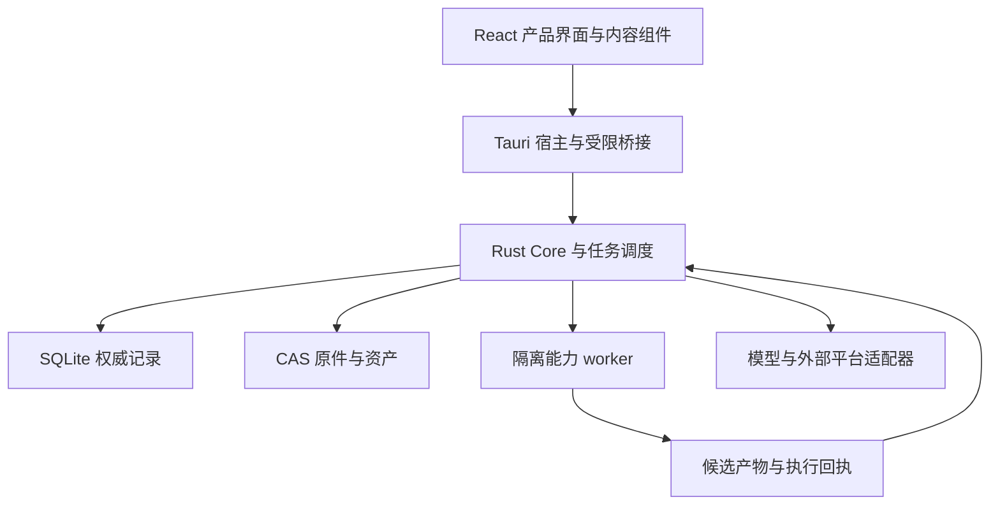

# AAOS 快速重构与多格式闭环任务包

版本：2026-10-04。对象：AAOS / ArcheAxis Knowledge。用途：交给 Codex、DSH 或 Hermes 实施。状态：执行规格，尚未修改仓库、运行 Windows 安装版或完成真人验收。

用户已经选择重构。本包以 **最快形成真实可用产品、最短必要架构、完整资料闭环、尽可能多的有效格式** 为目的。正式目标栈收敛为 **Tauri 2 + React + TypeScript + Vite，Rust Core + SQLite/CAS，按需隔离 Python workers**。第二份《AAOS 未来延展与可持续架构任务包》沿用本包的架构和数据接口；它扩展能力，不建立另一套知识真值。

“完整架构”指用户操作、权威写入、后台任务、证据、学习、导出和恢复都能形成闭环。“更多格式”按真实内容处理、锚点、读回和错误回执验收，不以扩展名白名单、探测成功或保留原件计算成功。

## 1 决策与当前证据

| 事项 | 本包裁决 |
|---|---|
| 桌面方向 | 新建受控的 Tauri 2 正式客户端，逐切片替代 Avalonia；不再维护两套长期正式 UI |
| 已有 Rust 工程 | 优先直接复用 domain、application、store、archive、api、migration 和 worker 协议；按真实缺口重构 |
| Python | 保留有效解析、OCR、ASR、课程与模型 worker，不重建 Python 权威后台 |
| 历史 Web 与 Tauri | 分类吸收组件、交互、资产和测试；不把旧 Python 后端重新接成正式后台 |
| 数据 | Rust 是唯一业务写者；SQLite 管权威记录，CAS 管原件与大资产，索引是可重建投影 |
| 架构状态 | 用户最新决定已经取代旧包的“不新建 React/Tauri 正式壳”限制；工程登记仍要记录这次替代关系 |
| 交付范围 | 本包的真实闭环先通过；高级扩展按第二包推进；所有有效能力都可发现 |

已读取的项目证据：

- 2026-10-04 完整执行任务包及统一接管提示词；包含全能力可发现、真实桌面视觉、全面知识库互通目标。
- main 的本轮只读快照为 59498723a8d4e94c6314e490473ba6d60847c247。
- PR #157 的本轮读取结果为 open / draft，head 为 32a4aa2e4b0182b38fdd155fd8c7deeda334b881，目标分支为 codex/Audit。此前对话里的 dfa934… 和 0134c433… 不能继续冒充最新 head。
- 在上述 PR head 读取了 AGENTS.md、DIRECTORY_AUTHORITY.yaml、Cargo.toml、CAPABILITY_ATLAS_V2.yaml、worker routes.json，以及 Office/Canvas worker 的局部实现。
- routes.json 当前有 13 个路由键。它已经是集中映射，不能把“三份手写路由需要收敛”原样重做。13 个路由键与旧报告的“15/15 路由读回”口径不同，不直接比较完成率。
- Office worker 的局部代码明确处理 DOCX/PPTX/XLSX/PDF；没有据此确认 DOC/XLS/PPT 或 ODF 已支持。
- 旧报告的 19 份资料、38 锚点、19 候选和测试数仍属报告时点。本轮没有重跑，不预填 PASS。

开工时刷新本地 HEAD、dirty diff、实际待集成 PR、数据库版本、安装身份和运行状态。上述快照是定位线索，不要求执行器回到过期提交。

## 2 最短必要架构

| 层 | 采用技术 | 必须承担 | 第一包不增加的维护负担 |
|---|---|---|---|
| 桌面宿主 | Tauri 2 / Rust | 窗口、菜单、文件选择、实例管理、系统集成、Core 生命周期 | 另一个业务领域层 |
| 产品界面 | React / TypeScript / Vite | 阅读、编辑、证据复核、学习、能力中心与恢复操作 | Next.js 常驻服务或第二套前端框架 |
| UI 基础 | shadcn/ui 的选定基础组件与统一 Tokens | 键盘、焦点、弹层、表单、主题 | 多套全局主题或照搬第三方品牌 |
| 内容组件 | Tiptap/ProseMirror、PDF.js | 富文本与块节点、PDF 阅读、选区引用 | 同时维护两个主编辑器 |
| Core | 已有 Rust crates 和 local-service | 领域规则、授权、版本、任务、提交、审计与恢复 | 通用 Agent OS、完整微服务群 |
| 存储 | SQLite + SHA-256 CAS | 记录、事务、来源版本、大资产、恢复清单 | Redis、Neo4j 或必选独立向量库 |
| 能力 worker | 既有隔离 Python packs | 解析、OCR、ASR、模型、课程等候选计算 | 全量供体装进一个巨大环境 |

Tauri 2 可嵌入外部可执行程序；本包建议继续由现有 Rust local-service 承担独立 Core 进程。宿主只管理生命周期和客户端桥接，不立即把 Core 搬进 Tauri 进程。这样能保留现有 HTTP v2、worker 协议和测试，并为将来的 CLI、Web 和播放器提供同一套能力接口。[S02][S03]

架构关系：

共享内容组件经 HostAdapter 访问能力。它们不得直接导入 Tauri API、拿数据库句柄或私自调用外部模型。宿主差异封装在适配器中，知识、课程和证据不绑定窗口框架。

## 3 开工时只做必要对账

先读取本地 AGENTS、有效 Authority、R6/M0 current 台账和正在运行的 writer，再比较本轮需求差异。保留不可变 R6 任务包和旧回执；本包是重构增量规格，不成为第二份 current truth。

将重构决定登记到现有决策替代账本，分配现场真实可用的编号；不要猜 SUP 编号。按已有工程规则更新 desktop 技术声明、新目录归属、构建与验收路径。无需再次询问用户是否选择重构。

建议的新目录为 apps/ArcheAxis.Tauri/，内容组件按需放入 packages/content-editor/、packages/content-reader/、packages/ui/。这是建议路径，必须先对照目录 Authority 和实际现有目录；不能一口气新建所有未来模块空壳。packages/contracts/ 继续作为协议单源。

保留 apps/ArcheAxis.Desktop/ 作为迁移前行为和恢复参考。旧 frontend/、src-tauri/、desktop/ 按现行 legacy 分类逐文件吸收；不批量搬回正式运行路径。

## 4 宿主与 Core 接入

1. 新客户端先接一个真实只读流程：启动 Core → 握手 → 读取真实资料列表 → 打开一条来源。
2. Core 实际绑定 127.0.0.1:0 并回报地址、run_id 和合同版本；不先扫描空闲端口再关闭监听器。
3. 启动 token 只保留在 Rust 宿主受控内存中，不写普通日志、URL、localStorage 或内容文件。
4. 前端使用有限的业务命令，例如读取来源、保存草稿、提交候选处置、运行能力、查询作业、获取恢复状态。不要提供任意 URL 转发、任意 SQL、任意文件路径读写或通用 Shell。
5. 由现行 OpenAPI/JSON Schema 生成 TypeScript DTO，使用运行时校验处理版本、可空字段、错误与未知状态；禁止另写一套漂移 DTO。
6. Core 事件带序号与对象版本。宿主转发受限事件；断线后通过快照和后续事件恢复，避免重复学习计数。第一包复用已有事件机制，尚无可靠事件流时先用有界查询。
7. 本机每个数据根只有一个有效 writer；多窗口共享同一 Core 实例。Avalonia 和新客户端不能分别启动写者同时打开同一正式库。
8. supervisor 持续读取输出、处理取消和超时，只清理本次所属进程树。异常退出留下可恢复任务，不按程序名杀掉全部 Python 或 AAOS。

Tauri 官方文档说明，自定义应用命令默认可能向全部窗口开放，不能仅配置插件 capability 后就认定业务命令已受限。执行器要显式登记应用命令权限，并由 Core 再做对象范围、版本和主体校验。来自资料、网页或课程的任意脚本不进入有桌面权限的主界面。[S01]

## 5 数据与内容合同

优先扩展已有对象，不重复造同义实体：

| 对象 | 第一包必须具备 |
|---|---|
| Source 与版本 | 原字节、哈希、来源身份、时间、不可变修订 |
| Document 与 Block | 稳定 ID、类型、顺序、内容、属性、当前版本 |
| EvidenceAnchor | 来源版本、定位类型、定位值、摘录/摘要校验和、定位状态 |
| ClaimCandidate | 候选内容、关联来源、证据、状态、预期版本 |
| LearningEvent | 对象、作答、自评/客观评分、时间与时区、事件 ID、评分来源 |
| Job 与 Receipt | 输入版本、允许能力、运行身份、状态、取消点、产物、错误 |
| Export 与 BackupManifest | 数据库身份、CAS 引用、对象范围、完整性结果、恢复版本 |

编辑器节点 JSON 是文档内容的一部分；Tiptap 的显示状态不独自充当整套知识模型。Document/Block 合同与编辑器 JSON 通过版本化 codec 互转，未知节点保留并显示状态。同一次保存中提交同一版本的内容与投影，Core 校验后一次提交；索引、引用提取和 UI 视图均可重建。

普通用户编辑自动保存，提交失败显示未保存并允许恢复。用户写作不需要逐次候选审批。AI 提出的知识、规则或技能修改进入 Candidate，再由真实审核会话处置，不能仅靠 actor="human" 字符串证明真人。

原件进入 CAS 前先验证字节和 MIME。CAS 对象先持久化，再由短事务建立引用；事务失败留下的孤儿对象通过有宽限期的回收处理。任何来源版本修改都生成新版本，不覆盖旧原件。

证据必须绑定不可变来源版本。编辑导致定位失效时保留旧证据并提示重新定位，不自动跳到相似句子然后宣称仍准确。PDF 用页码/矩形；Office 用源 XML 对象、段落、单元格或幻灯片对象；音视频用时间区间；JSON/CSV 用路径或行列。定位能力不足时如实标明，不编造坐标。

耗时解析与模型调用在写事务外进行：取得输入快照 → worker 计算 → Core 校验输入版本与幂等键 → 短事务提交 → COMMIT 成功后响应。SQLite WAL 仍只有一个写者，不能把网络等待塞进长写事务。[S04]

## 6 多格式扩展策略

执行顺序以真实现有实现为先。登记“已存在代码、可探测、可调用、真实闭环、安装版合格”五个不同状态。

| 波次 | 格式族 | 第一包目标 | 关键区别 |
|---|---|---|---|
| A | TXT/Markdown 与结构化文本 | 正文、结构、草稿、链接与资产引用 | JSON/YAML 等对象不能只按文本丢掉结构 |
| A | PDF 文本页 | 原件、提取、PDF.js 阅读、页面引用 | 能保存 PDF 不代表能提取正文 |
| A | DOCX/PPTX/XLSX | 复用已有 Office worker，保留段落/幻灯片/单元格定位 | 提取值不等于公式计算；有损排版单独报告 |
| A | HTML | 安全正文、链接、结构和资源回执 | 脚本不执行，离线缺资源不能静默 |
| A | JSON Canvas | 节点、边、位置、外部引用及 loss receipt | 有文本投影不等于原生画布全功能 |
| A | PNG/JPEG/WebP 等图片 | 原图、OCR 或说明候选、区域/图像级引用 | 图片说明不等于可验证 OCR 结果 |
| A | 音频/视频 | 元数据、实际转写、时间段引用、播放器 | probe 成功不计作 ASR 成功 |
| A | SRT/VTT 等字幕 | 时间段、文本、编码与源定位 | 文本顺序与时间合法性分别检查 |
| A | ZIP/TAR 归档 | 安全清点、受限展开、内部支持文件闭环 | 空目录清点不算新增“正文格式” |
| B | CSV/TSV、JSON/JSONL、YAML/TOML/XML | 优先轻量解析复用与结构预览 | 不引入第二数据库或任意执行 |
| B | EPUB | 目录、章节、资产、段落锚点 | 解压成功不算阅读和引用通过 |
| B | EML | 邮件头、正文、附件、来源身份 | 不能把附件遗漏计入成功 |
| C | 扫描 PDF 与复杂表格 | 用当前 OCR；具体质量不足时再试 Docling | 按真实样本与资源峰值判断 |
| C | DOC/XLS/PPT、ODT/ODS/ODP、MHTML | 有合格现有引擎则接入；否则明确可选依赖 | 不要求为最大数量自动下载 LibreOffice/大型模型 |

A 波次是“复用既有路径的候选首批”，不表示每个扩展名已通过；具体支持集合由现场探测和样本确定。B 波次在核心旅程稳定后追加轻量适配。C 波次只在现有环境或明确批准的必要依赖上实施，不让重型引擎阻断第一版可用产品。

各文件扩展名只有在自己的样本通过后，才计入 verified_extension_count。格式族按有意义的正文/结构/时间能力计数。RAW_ONLY、METADATA_ONLY、EXTRACTED、ANCHORED、LOOP_VERIFIED、BLOCKED 是本包的概念标签，先映射项目现行状态，不直接当作新生产枚举安装。

支持表同时列出：样本数、原件哈希、提取内容、结构、定位类型、损失、冷启动读回、安装态结果、可选引擎及版本。禁止以一个总百分比替代失败项目。

解析 ZIP/TAR/XML/HTML 时落实大小、数量、嵌套、路径、资源和超时约束。worker 输出结构与 staging 资产引用，正式入库只能经 Core。

## 7 第一版真实产品界面

沿现有批准 Tokens 精修，采用一套 React 设计系统。先做阅读与证据复核样板，通过后扩展全部当前流程。深浅主题是否同时交付按现有批准要求对账，不另作随机配色。

六个组织域沿最新任务包映射，稳定 capability ID 不变：

| 域 | 第一包可操作入口 |
|---|---|
| 工作台 | 继续阅读/学习、真实任务、待处理事项、快捷捕获 |
| 知识 | 资料库、导入、原件阅读、笔记、引用、候选审核、导出 |
| 学习 | 当前复习队列、练习、讲解、学习事件与下次复习 |
| AI 学习 | 当前评测/纠正/候选资产；未实现项打开正式详情 |
| 探索与蓝图 | 完整有效能力目录与详情，显示真实依赖和进展 |
| 系统与能力 | 提供方、worker 健康、模型引用、任务、权限、备份恢复 |

内容区使用本地资源。PDF、Office 结构预览、图片、媒体与文本根据格式选择阅读器，Inspector 显示来源、证据与版本。不要让原文、目录、队列、Inspector 同时挤成过窄的多栏。

所有已实现入口接真实 Core；未来入口有场景、依赖、供体、执行条件和当前状态。没有实现时只禁用执行动作，详情仍可访问。能力目录、运行实现、连接/权限、即时健康分别有单一来源，用 capability_id 联接。

Tiptap 开源核心采用 MIT；部分 Pro 扩展收费。第一包只采用核验过的开源节点和组件，保留领域扩展接口。[S06] PDF.js 是阅读供体，批注、知识和证据仍由 Core 管理。[S07] shadcn/ui 提供可吸收的基础组件代码，吸收后 AAOS 自己负责升级与主题一致性。[S08]

## 8 最短完整用户旅程

必须在同一份真实资料上完成：

1. 选择资料，查看预处理与范围，导入原件和结构。
2. 打开阅读器并定位原文；原件和解析内容有清晰关系。
3. 建立笔记，保存、撤销与再次打开；引用原文并回跳。
4. 生成或读取已有知识候选；由真人接受、拒绝或待补证，保留证据和版本。
5. 从已选知识创建学习项或使用已有项；作答、自评/客观评分分别记录，显示实际复习计划。
6. 产生一项可追溯的 AI 使用/纠正候选；存在实测评估时才展示效果，没有时保持未评估。
7. 导出选定来源、笔记、证据与学习记录；重新读取并比较。
8. 完全退出所属进程后重新启动，资料、版本、候选处置和学习事件读回。
9. 做一致备份，在独立副本恢复并验证 CAS 引用，重新完成阅读和学习继续。

不要求每个媒体文件都强制生成教学内容。每个格式完成共同的导入→结构/内容→定位→候选/引用→读回/export检查；学习与 AI 纠正至少在代表性真实资料上走完完整旅程，避免为扩展名重复制造大量无价值课程。

备份采用 Core 协调的一致快照或 SQLite Backup API，加上对应 CAS 引用清单和保留策略；不能复制正在写入的 db/wal/shm 就宣布可恢复。[S05] 切换 schema 后，回滚使用旧程序与迁移前一致副本，不让旧程序直接打开新 schema。恢复后新增数据另行保存和审查，不承诺能用降级 SQL 自动还原全部变化。

## 9 实施顺序

| ID | 工作 | 依赖 | 本次产物 | 完成条件 |
|---|---|---|---|---|
| Q00 | 现场保护与最小对账 | 无 | 真实 SHA、dirty、writer、数据根、schema 和资产身份 | 没有覆盖未知现场；现有可用项已标证据 |
| Q01 | 重构决定与目录登记 | Q00 | 现有 Authority 的最小 delta、目录与构建路径 | 用户重构决定可追溯；R6/M0 历史未改写 |
| Q02 | Tauri 启动与只读桥接 | Q01 | 真实 Core 生命周期与资料列表 | 独立运行、握手、退出、重启通过 |
| Q03 | 类型合同与权限 | Q02 | 生成 DTO、有限命令、对象权限 | UI 无 token/SQL/任意 Shell；版本错误明确 |
| Q04 | 原件与文档保存 | Q03 | 可版本化 Document/Block、CAS 原件、草稿保存 | 提交与恢复一致，无第二真值 |
| Q05 | 阅读与证据样板 | Q04 | PDF.js/Tiptap 接入与真实桌面截图 | 中文 IME、引用回跳、焦点、缩放可用 |
| Q06 | A 波次多格式吸收 | Q03、Q04 | 现有 worker 接入、格式矩阵 | 每种声明格式有真实样本与回执 |
| Q07 | 候选审核与纠正 | Q05、Q06 | 真人审查、版本冲突、撤回 | AI 不能自证真人；历史可追踪 |
| Q08 | 学习与 AI 资产闭环 | Q07 | 学习事件、复习、AI 使用/纠正候选 | 幂等计数、重启读回、诚实效果状态 |
| Q09 | 搜索与完整能力目录 | Q04 | 真实检索、有效能力地图、状态区分 | 已实现可调用，未来可浏览 |
| Q10 | 导出与首个互通 profile | Q04、Q06 | Markdown/Obsidian 的限定范围交换 | 独立外部软件回读；损失可见 |
| Q11 | 备份与副本恢复 | Q04、Q08 | 一致快照、CAS 清单、恢复演练 | 安装身份与数据完整性可核对 |
| Q12 | B 波次轻量扩展 | Q06、Q11 | 按收益扩展结构文本、EPUB、EML 等 | 不拖慢主闭环，不伪造新增数量 |
| Q13 | 性能与故障验证 | Q05–Q11 | 全进程树、取消、崩溃、断网与恢复证据 | 已定义预算无关键失败 |
| Q14 | Windows 安装态资格化 | Q11、Q13 | 独立候选安装包和旅程回执 | 不依赖开发服务器或 WSL；实际桌面通过 |
| Q15 | 第一包收口与第二包交接 | Q14 | 当前台账更新、未完成矩阵、接口与恢复点 | 核心旅程通过；未来任务有真实基线 |

同一文件只有一个 writer。单执行器按依赖执行即可。使用多个执行器时按目录分工：桌面/内容、Core/合同/存储、worker/格式、集成验收；共享合同先定归属。任务拆分不要求新增常驻多 Agent 平台。

## 10 验收与工程预算

仓库既有门禁优先，本包增加以下实际验收：

- G1：真实 Tauri Windows 应用启动并接既有 Core；没有开发环境依赖。
- G2：文档保存、版本与证据一致，AI 修改受控，普通写作可自动保存。
- G3：格式矩阵逐行有输入、结果、定位、损失和安装态证据；声明与结果一致。
- G4：真人审核、学习事件、AI 纠正/评估、导出、重启和恢复闭环完成。
- G5：全有效能力可发现，无死链接、假运行或假 KPI；实际 UI 视觉合格。
- G6：备份/副本恢复与迁移回退通过；新客户端不会破坏唯一正式库。

性能是待实测的工程目标。建议首轮以用户的 64GB 内存/8GB 显存机器建立基线：核心界面冷启动 P95 目标不高于 3 秒，基础闲置进程树内存目标不高于 1GB；均排除明确运行的 OCR/ASR/模型任务并另列这些任务峰值。目标需在 Q00/Q02 明确测量条件；若与实际规模冲突，保留差异和理由后调整，不能事后改阈值掩盖失败。

阅读器只渲染可见 PDF 页；长列表和大型表格虚拟化；编辑内容懒加载；3D/其他未来模块不进入首屏。GPU 重任务默认一个并行槽，实际显存高水位决定批量与上下文；不把 64GB 内存算成可用显存。

测试分层：既有 Rust/Python 回归 + 协议/迁移测试 + Web 内容组件交互测试 + Tauri WebDriver 的真实 Windows 旅程。Playwright 的浏览器通过不自动等于 Tauri 安装态通过；Tauri 官方有独立 WebDriver 工作流。[S09]

## 11 发行与可选依赖

建议首版按用户级 Windows 安装、相对可信安装根定位资源、数据根独立、共享模型只引用。WSL2 用于开发，不是产品启动前提。

发行至少区分：
- 基础产品包：Tauri、Core、本地界面、必要解析能力。
- 离线依赖包：实际需要的 WebView2 和 worker 依赖。
- 可选能力包：较重 OCR/ASR/Docling/模型等，按任务启用。

第一版可以先交付前两项合并的离线安装候选，不必先建设能力商店。完整安装体积必须实测，不能引用“Tauri 初始约几百 KB”代替产品体积。[S10]

核验最终二进制内 SQLite 的运行版本，不只看 Rust 包版本。官方记录 WAL-reset 问题已在 3.51.3 及之后版本修复，并有 3.44.6/3.50.7 回移植；本包要求采用包含修复的合格运行版本和单写者/协调 checkpoint，不能因单写者设计而忽略实际依赖版本。[S04]

## 12 完成和中断交接

每项回报包含完整 SHA、dirty diff、构建产物身份、PID/run_id、数据/schema/合同版本、样本、命令与 exit、截图/回执、未测项和恢复点。Code Present、Reported、Tested、Installed Qualified、Owner Accepted 分别记录，不用主观完成百分比。

中断后只读最新现场回执、正在执行的任务和必要合同。不要重新吞全部历史 ZIP 或重新做一轮开放式选型。第一包通过后，第二包从实际接口、格式矩阵、数据模型和恢复点接手。

本轮文件检查只证明任务包完整，不证明 AAOS 已运行通过。checks/ 中的产品验收初始全部为 NOT_RUN。

## 官方资料与项目快照

下列资料用于核验组件能力、接口和许可边界。具体安装版本/commit 在实施时锁定；下面的功能选择属于本方案的工程建议，不代表已接入 AAOS。部分资料是可变页面，后续升级按精确 revision 重验。

| ID | 资料 | 本包使用范围 |
|---|---|---|
| S01 | [Tauri Capabilities](https://v2.tauri.app/security/capabilities/) | 窗口权限、自定义应用命令、权限边界 |
| S02 | [Tauri Process Model](https://v2.tauri.app/concept/process-model/) | 宿主与 WebView 进程模型 |
| S03 | [Tauri Sidecar](https://v2.tauri.app/develop/sidecar/) | 外部 Core 可执行程序 |
| S04 | [SQLite WAL](https://sqlite.org/wal.html) | 单写者、事务、checkpoint 和已修复 WAL-reset 问题 |
| S05 | [SQLite Backup API](https://sqlite.org/backup.html) | 一致数据库快照 |
| S06 | [Tiptap Overview](https://tiptap.dev/docs/editor/getting-started/overview) | ProseMirror、开源核心与 Pro 扩展边界 |
| S07 | [PDF.js](https://github.com/mozilla/pdf.js) | PDF 解析与显示，Apache-2.0 |
| S08 | [shadcn/ui](https://ui.shadcn.com/docs) | 可吸收组件代码与设计系统 |
| S09 | [Tauri WebDriver](https://v2.tauri.app/develop/tests/webdriver/) | 桌面集成测试路径 |
| S10 | [Tauri Windows Installer](https://v2.tauri.app/distribute/windows-installer/) | WebView2 和在线/离线发行 |
| S11 | [AFFiNE](https://github.com/toeverything/AFFiNE) / [许可证](https://github.com/toeverything/AFFiNE/blob/canary/LICENSE) | BlockSuite 供体和不同目录许可边界 |
| S12 | [Docling](https://github.com/docling-project/docling) | 复杂文档解析；代码与模型许可分开 |
| S13 | [OpenMAIC](https://github.com/THU-MAIC/OpenMAIC) | 课程 DSL/renderer/交换；包级许可 |
| S14 | [tldraw License](https://tldraw.dev/community/license) | 生产许可要求 |
| S15 | [Notion Export](https://www.notion.com/help/export-your-content) | 导出与重建工作区限制 |
| S16 | [Anki Exporting](https://docs.ankiweb.net/exporting.html) | deck/collection 包、调度与媒体语义 |
| S17 | [JSON Canvas](https://jsoncanvas.org/spec/1.0/) | 节点、边、位置与引用格式 |
| S18 | [DeepTutor](https://github.com/HKUDS/DeepTutor) | 辅导/练习/研究供体，Apache-2.0 |
| S19 | [LearningMAP](https://github.com/ai-for-edu/LearningMAP) | 诊断方法候选，Apache-2.0 |
| S20 | [OpenTutor](https://github.com/zijinz456/OpenTutor) | 自适应交互候选，MIT |
| S21 | [Manim](https://github.com/ManimCommunity/manim) | 数学动画 worker |
| S22 | [React Three Fiber](https://github.com/pmndrs/react-three-fiber) | Three.js React 场景呈现 |
| S23 | [Godot OpenXR](https://docs.godotengine.org/en/stable/tutorials/xr/openxr_settings.html) | 专用 XR 播放器和设备配置 |
| S24 | [Crossref REST API](https://www.crossref.org/documentation/retrieve-metadata/rest-api/) | 文献元数据入口 |
| S25 | [OpenAlex Help](https://help.openalex.org/) | 当前官方文档入口；实际额度和 API 在接入时核验 |
| S26 | [Zotero Web API v3](https://www.zotero.org/support/dev/web_api/v3/) | 文献、文件、全文和同步接口 |
| S27 | [PaperQA](https://github.com/Future-House/paper-qa) | 文献问答 worker 候选 |
| S28 | [Yjs](https://github.com/yjs/yjs) | 未来草稿协同组件 |
| S29 | [MCP Rust SDK](https://github.com/modelcontextprotocol/rust-sdk) | 受限领域工具接口 |
| S30 | [React Flow](https://github.com/xyflow/xyflow) | 节点与关系 UI，MIT |
| S31 | [Excalidraw](https://github.com/excalidraw/excalidraw) | 手绘编辑组件，MIT |
| S32 | [TanStack Table](https://github.com/TanStack/table) | 表格 UI；不提供 AAOS 领域语义 |
| S33 | [fsrs-rs](https://github.com/open-spaced-repetition/fsrs-rs) | 调度与优化候选，BSD-3-Clause |

项目只读快照：main@59498723a8d4e94c6314e490473ba6d60847c247；[PR #157](https://github.com/DTALEX66/ArcheAxis-Knowledge-OS/pull/157) head@32a4aa2e4b0182b38fdd155fd8c7deeda334b881。查看 [AGENTS](https://github.com/DTALEX66/ArcheAxis-Knowledge-OS/blob/32a4aa2e4b0182b38fdd155fd8c7deeda334b881/AGENTS.md)、[Cargo workspace](https://github.com/DTALEX66/ArcheAxis-Knowledge-OS/blob/32a4aa2e4b0182b38fdd155fd8c7deeda334b881/Cargo.toml)、[Capability Atlas](https://github.com/DTALEX66/ArcheAxis-Knowledge-OS/blob/32a4aa2e4b0182b38fdd155fd8c7deeda334b881/docs/truth/CAPABILITY_ATLAS_V2.yaml)、[worker routes](https://github.com/DTALEX66/ArcheAxis-Knowledge-OS/blob/32a4aa2e4b0182b38fdd155fd8c7deeda334b881/services/python-workers/routes.json)。

既有文件依据：AAOS_完整执行任务包_20261004.md（本轮读取的要求与互通章节）及 AAOS_统一接管启动提示词_20261004.txt。没有完整重审历史 47 个素材 ZIP/369 项研究池；实施时继承真实有效清单并补差，不用本包条目数替代历史范围。

