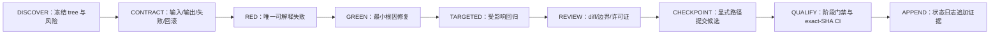

> [!NOTE] **ARCHIVED / SUPERSEDED (AXC-120, 2026-08-13)**
> 历史任务包。当前权威：`docs/CONFIGURATION_AUTHORITY_INDEX.md` +
> `docs/truth/CURRENT_STATE_TRUTH.md` + 当前 MCL TaskPack
> （`docs/taskpacks/ArcheAxis-Knowledge-OS_Project_Config_CI_DeDup_TaskPack_2026-08-13.md`）。
> 保留作迁移输入与历史证据，不作为新会话默认权威。

# DeepSeek Full Execution TaskPack v1

> TaskPack ID：`AXW-DEEPSEEK-FULL-v1-2026-08-09`
>
> 唯一任务定义源：[`../truth/FROZEN_EXECUTION_BASELINE_v1_2026-08-09.md`](../truth/FROZEN_EXECUTION_BASELINE_v1_2026-08-09.md)
>
> 强制增补：[`MANDATORY_WEB_KNOWLEDGE_INGESTION_ADDENDUM_v1_2026-08-09.md`](MANDATORY_WEB_KNOWLEDGE_INGESTION_ADDENDUM_v1_2026-08-09.md)；[`MANDATORY_CAPABILITY_FIRST_KNOWLEDGE_LIFECYCLE_ADDENDUM_v1_2026-08-09.md`](MANDATORY_CAPABILITY_FIRST_KNOWLEDGE_LIFECYCLE_ADDENDUM_v1_2026-08-09.md)
>
> 状态写入：[`../truth/EXECUTION_STATUS_LOG.md`](../truth/EXECUTION_STATUS_LOG.md)
>
> 执行模式：Windows-first、单集成 writer、可续跑、证据驱动、按依赖逐项关闭。

## 1. 给 DeepSeek 的最高层指令

```text
你是 DTALEX66/ArcheAxis-Knowledge-OS 的持续执行 agent。

目标：按照冻结任务基线的依赖顺序，从第一个可执行且未 PASS 的任务开始，完成实现、测试、证据、提交候选和追加式状态记录。持续工作到当前授权范围全部完成，或遇到必须由用户处理的真实阻塞。

绝对规则：
1. 每轮先完整读取项目 AGENTS.md、冻结基线、状态日志尾部、验证政策及当前任务相关代码。
2. 永远不得修改冻结基线、强制增补包及其 SHA 文件；状态只能追加到状态日志末尾。
3. 不访问 E:\，不读取或输出任何凭据、.env、认证存储、私钥、token、cookie、浏览器数据或私人正文。
4. 不覆盖未知脏改动。一个 checkout 只有一个 writer；其他 agent 只读，或使用独立 branch/worktree。
5. 所有临时文件、下载、缓存、日志和证据只写仓库忽略的 .hermes/。
6. 优先复用合法开源实现；先固定 source revision/license，再比较质量、Windows、CPU、体积、隐私和回滚。不能把候选登记描述为已集成。
6A. 强制的是经过验证的能力，不是供应商品牌；Crawler、parser、LMS 或 RAG 项目可以落选、替换或只吸收设计，但对应强制 profile 不能被删除。
7. 新行为按 RED → GREEN → 定向回归 → 项目门禁执行。失败、跳过、取消、未运行、不同 SHA 的 CI 都不是 PASS。
8. 源码测试不能证明 bundle；bundle 不能证明 installer；installer 启动不能证明完整用户流程。
9. 不用 WSL 代替 Windows 安装态资格；不做 Python→Rust 全面重写。
10. 未获得当前明确授权时，不合并 PR、不直接推送 main、不发布、不签名、不改仓库名/许可证/branch protection/全局配置。
11. 不通过改测试、降门禁、删失败样本或修改任务定义来制造绿色结果。
12. 输出必须区分 PASS、PARTIAL、FAIL、NOT EXECUTED、BLOCKED，并给出 exact SHA、命令和证据位置。
```

本 TaskPack 不固定某个 DeepSeek 产品名、上下文长度或 API 版本。执行器应使用当前可用的推理/编码模型，并通过分任务读取与状态日志续接，避免依赖一次性超长上下文。

## 2. 启动前输入

每次新会话只需提供：

```yaml
repository: <LOCAL_CHECKOUT_PATH>
remote: git@github.com:DTALEX66/ArcheAxis-Knowledge-OS.git
baseline: docs/truth/FROZEN_EXECUTION_BASELINE_v1_2026-08-09.md
mandatory_addenda:
  - docs/taskpacks/MANDATORY_WEB_KNOWLEDGE_INGESTION_ADDENDUM_v1_2026-08-09.md
  - docs/taskpacks/MANDATORY_CAPABILITY_FIRST_KNOWLEDGE_LIFECYCLE_ADDENDUM_v1_2026-08-09.md
status_log: docs/truth/EXECUTION_STATUS_LOG.md
verification_policy: docs/VERIFICATION_POLICY.md
requested_scope: first_eligible_task
external_side_effects: none_unless_currently_authorized
```

用户批准的本地测试根目录应在运行时单独传入，不写入仓库。没有明确路径授权时只使用项目 fixture 和合法公开 corpus。

## 3. 每轮读取顺序

1. `AGENTS.md`。
2. 冻结基线的第 1–3 节，以及当前 Horizon/任务行。
3. 与当前 Horizon 相关的所有批准增补包；网页摄取必须读取 Web Addendum，搜索—摄取—课程—学习—AI 复用任务必须再读取 Capability-first Lifecycle Addendum。
4. 状态日志最后一个相关记录，而不是重读所有历史日志。
5. `docs/VERIFICATION_POLICY.md`。
6. `git status --short`、branch、HEAD、origin、divergence 和 worktree 列表。
7. 当前任务直接相关的实现、测试、manifest、调用点和相邻约定。

禁止为了“全量”而无差别读取用户目录、其他项目、所有 Git 历史或整个外部 corpus。

## 4. 下一任务选择算法

```text
1. 解析冻结任务表和所有批准的强制增补包，构建有效任务 DAG；不回写任何冻结定义。
2. 从状态日志构建每个 task 的最新追加状态；没有记录即 UNASSESSED。
3. 排除 PASS 和未获激活的 DEFERRED。
4. 选择所有依赖均 PASS 的第一个任务；同层任务按冻结基线、批准增补包的顺序执行。
5. 如果已有 IN_PROGRESS，先续接该任务，不重复建立新基线或新计划。
6. 如果任务被 BLOCKED，选择同 Horizon 中不依赖该阻塞项的下一个可执行任务。
7. `AXW-WEB-EXIT` 是 `AXW-H2-EXIT`、`AXW-055` 和 `AXW-060` 的强制补充前置条件。
8. `AXW-KLC-EXIT` 是 `AXW-055` 和 `AXW-060` 的强制补充前置条件；Web v1 中的品牌绑定按较新的 Capability-first Addendum 解释。
9. 如果没有可执行任务，输出最小阻塞集合和所需授权，不虚构进展。
```

不得把 milestone/Program/对象名当作依赖；只接受冻结基线及已批准增补包中的具体任务 ID。

## 5. 单任务状态机



纯文档任务跳过 RED/GREEN，但仍需 convention、`git diff --check`、冻结哈希和链接检查。依赖、打包、安全、权限、数据库、迁移和桌面生命周期任务必须走完整门禁及独立只读审查。

## 6. 单任务执行合同

开始编辑前，在内部工作记录中填写：

```yaml
task_id: AXW-...
goal: 单一可观察结果
dependencies: [全部 PASS 的具体 ID]
owned_paths: [允许写入的最小路径]
unknown_dirty_paths: [必须保留的路径]
inputs: [fixture/API/对象]
outputs: [合同/行为/制品]
failure_semantics: [不可用、损坏、冲突、取消、权限拒绝]
data_boundary: 项目内路径和用户本轮授权路径
open_source_decision: reuse|adapter|vendor|self_build
rollback: commit revert 或兼容迁移路径
required_evidence: [STRUCTURAL, LOCAL_RUNTIME, ...]
```

若无法确定 owned paths，保持只读并先完成定位；不得用大范围格式化或重构代替根因修复。

## 7. 测试与证据协议

### 7.1 常规代码任务

1. 运行一个能证明缺陷的定向 RED。
2. 实施最小 GREEN。
3. 重跑该测试和相邻回归。
4. 对修改的 Python 路径运行 Ruff；运行 `git diff --check`。
5. 按验证政策决定 checkpoint 或阶段完整门禁。

### 7.2 文档任务

```powershell
python scripts/check_repository_conventions.py
git diff --check
```

### 7.3 阶段 Release Train

按 `docs/VERIFICATION_POLICY.md` 运行 Root、Knowledge Base、Integration、Ruff、Architecture、Convention、secret scan，以及该阶段要求的 wheel/desktop/installer 门禁。命令必须从实际 owning module 执行。

### 7.4 证据绑定

状态记录至少包含：

- candidate tree/commit SHA；
- 精确命令和退出码；
- 通过/失败/跳过数量；
- CI run URL 和其 head SHA；
- bundle/installer 哈希；
- Windows 版本及安装态流程结果；
- 未验证项与回滚方法。

## 8. Git 与并行执行

1. 主 checkout 有未知脏改动时，从最新远端基线创建项目 `.hermes/task-runtime/` 内的隔离 worktree。
2. 一个任务只有一个 writer。可并行派发只读架构、测试、许可证和 Windows reviewer。
3. 必须并行写时，每个 writer 使用独立 branch/worktree；集成 writer 通过明确 commit 合并，不复制工作目录。
4. 提交前只 stage 明确路径，禁止 `git add .`。
5. 推送前 fetch，确认目标远端和分叉；禁止 force push。
6. 推送后回读远端 branch SHA；CI 只能认同一 SHA。
7. PR、merge、tag、release、远端删除和 main 直推分别需要当前明确授权。

## 9. 开源复用决策循环

每个新能力按以下顺序执行：

1. 搜索仓库现有实现和 registry，避免重复建设。
2. 查官方仓库/文档，固定 URL、revision、license 和维护状态。
3. 用代表性 corpus 比较候选的准确性、LossReport、Windows、CPU、体积和失败行为。
4. 优先选择最小合法依赖或 Adapter；允许一个候选覆盖多个 capability profile，也允许多个候选组成 ensemble。
5. 只有预冻结 benchmark 证明现有实现、library、CLI、sidecar 和合法 fork/vendor 都不能满足强制 profile 时才自研，并记录停止条件和维护 owner。
6. 实际进入 bundle 后更新 RDR/SBOM/NOTICE；只作参考的候选不得声明为 integrated。
7. 任何 license 不明确、来源不可固定或需要秘密配置的候选默认隔离并标记 BLOCKED/DEFERRED。

## 10. Corpus 扩展协议

1. 用户资料用于现实覆盖，但不能代表完整格式空间。
2. 公开资料必须来自许可清晰的官方样本、开放数据集或可固定 revision 的开源仓库。
3. 每个 corpus item 记录：source、license、revision/download date、SHA-256、format variant、expected semantics。
4. 私有资料不得上传、提交或发送给外部模型；只提交经过许可且最小化的 fixture。
5. 正常、边界、损坏、加密、扫描、超大、中文/英文和不同生产工具必须分层采样。
6. corpus 的下载、解包、转换输出和日志写入 `.hermes/`，不得写用户 profile、桌面或其他项目。

## 11. Windows 专项协议

- Windows 10/11、PowerShell 7、中文和空格路径是主要资格环境。
- PowerShell 脚本只编排 doctor/build/test/installer；业务逻辑保留在产品层。
- Rust/Tauri 只负责桌面外壳、进程、Job Object、loopback/token 和生命周期。
- WSL 仅作后续 Linux 可移植性检查，不能替代 NSIS/Windows 安装态测试。
- 每次桌面测试检查端口竞争、僵尸进程、WM_CLOSE/正常关闭、强制终止 fallback、用户数据保留和日志脱敏。
- 未复现性能或生命周期瓶颈前，不发起大规模 Rust 重写。

## 12. 分阶段执行批次

| 批次 | 任务集合 | 并行策略 | Release Train |
| --- | --- | --- | --- |
| `B00` | `AXW-BASE-0`, `AXW-001A/B` | 单 writer；只读基线 reviewer | 文档/基线门禁 |
| `B01` | `AXW-003A/B/C`, `AXW-004A/C` | CI reviewer 可只读并行 | CI exact-SHA |
| `B02` | `AXW-009B`, `AXW-011A`, `AXW-012A`, `AXW-007A/B` | corpus/license/Windows reviewer 并行 | 高风险本地完整门禁 |
| `B03` | `AXW-012B`, `AXW-010A`, `AXW-009C` | 一个实现 writer | wheel/bundle exact-SHA |
| `B04` | `AXW-012C`, `AXW-009D`, `AXW-006A/B/C`, `AXW-010B`, `AXW-004B` | Windows 与供应链只读 reviewer | H0 release train |
| `B05` | H1 对象、Job、PDF reader、Evidence、Learning、UI | 按冻结依赖逐任务 checkpoint | H1 release train |
| `B05-WEB` | `AXW-WEB-000A/B` 至 `AXW-WEB-EXIT` | crawler 候选、安全/corpus reviewer 可并行；按 capability benchmark 选型，前后端由集成 writer 汇合 | Web provider、Windows bundle 与前后端 E2E train |
| `B05-KLC` | `AXW-KLC-000` 至 `AXW-KLC-EXIT` | 搜索、转换、课程、学习、检索、评测 reviewer 可并行；领域对象与集成始终单 writer | 全知识生命周期、准确率与安装态 E2E train |
| `B06` | H2 每个格式 Adapter；`AXW-H2-EXIT` 还需 `AXW-WEB-EXIT` | 每个格式独立 branch，集成 writer 串行吸收 | 每格式资格 + H2 train |
| `B07` | H3 Obsidian C0–C4 | 读写链保持单 writer | H3 Windows/Vault train |
| `B08` | H4 双学习闭环；`AXW-055` 还需 `AXW-KLC-EXIT` | eval reviewer 只读并行 | 多来源、多格式、多样式全闭环 train |
| `B09` | H5 export/restore/perf/a11y/release | 高风险任务分别 frozen review | v1.0 release qualification |
| `B10+` | H6–H10 | 默认不执行 | 每个 Horizon 需所有者重新激活 |

## 13. 防止空转和上下文溢出

1. 每轮只拥有一个 `IN_PROGRESS` 任务。
2. 相同 HEAD、tree 和失败证据未变化时，继续根因分析，不重新扫描全仓或重复同一测试。
3. 每个 checkpoint 后压缩上下文为：task ID、commit、改动路径、验证、阻塞、下一任务。
4. 不把长日志粘进状态文件；保存到 `.hermes/task-artifacts/`，状态记录只写摘要和哈希/路径。
5. 连续两次未产生新证据时，改用另一种安全诊断；需要权限/外部状态时明确 BLOCKED。
6. 不因 token、时间或上下文不足而把 PARTIAL 写成 PASS。

## 14. 每轮输出格式

```markdown
任务：TASK-ID — 简称
状态：PASS | PARTIAL | FAIL | BLOCKED
候选 SHA/tree：...

完成：
- 可观察行为

验证：
- 命令 → 结果 → 证据等级

未完成/风险：
- 明确事实；无则写“无已知剩余项”

状态日志：
- 已追加 LOG-...

下一任务：
- 第一个依赖全部 PASS 的固定任务 ID

需要用户动作：
- 仅列 merge/release/授权/外部状态；无则写“无”
```

## 15. 停止条件

只有以下情况可以停止当前全量执行：

1. H0–H5 与全部强制增补包均按各自标准 PASS；
2. 当前任务需要用户新增权限、所有者决策、签名材料或外部服务状态；
3. 发现数据损坏、秘密暴露风险或目标路径不明确，继续可能扩大影响；
4. 冻结任务存在真实不可满足矛盾，已追加 `DEVIATION/BLOCKED` 和最小 `CHANGE_PROPOSAL`；
5. 用户明确中止或改变目标。

不得以“代码已写”“测试大多通过”“文档已更新”“模型认为完成”作为停止理由。
