# Mandatory Capability-First Knowledge Lifecycle Addendum v1

> 增补包 ID：`AXW-KLC-ADDENDUM-v1-2026-08-09`
>
> 状态：`OWNER-APPROVED-MANDATORY`
>
> 权威来源：2026-08-09 所有者最新澄清——爬虫项目本身可以不集成，但对应能力必须被吸收；如果合法、可维护的同类实现不能满足门禁，才允许自研。
>
> 关系：本文件不修改冻结基线或 Web Addendum v1 的原文和哈希；它是较新的能力优先解释层，并新增搜索到人类学习和 AI 复用的强制任务 DAG。

## 1. 不可降级的产品目标

ArcheAxis Workspace 必须形成以下完整闭环，而不是只完成文件导入、网页转 Markdown 或普通 RAG：

```text
学习目标 / 研究问题
→ 多源搜索与发现
→ 合法、安全、可恢复的资料摄取
→ 原始资料不可变保存
→ 多形式、多格式、高保真转换
→ 去重、版本、来源、证据与冲突建模
→ 知识单元、概念与能力图谱
→ 课程、课时、示例、练习、测验与多样式学习对象
→ 人类阅读、练习、复习、迁移与掌握
→ Approved-only AI 检索、引用回答、Skill/Prompt/机器知识复用
→ 人工真值评测、反馈和持续改进
```

以下原则是发布门禁：

1. **能力强制，品牌可替换。** Crawl4AI、Spider、Crawlee、Scrapy、Firecrawl 等只是候选能力来源，不是核心领域模型。
2. **复用优先，自研兜底。** 先复用仓库已有实现，再评估官方库/CLI/sidecar、合法 fork/vendor；只有代表性 benchmark 证明没有候选满足合同，才自研缺失能力。
3. **Raw-first、Evidence-first。** 任何解析、课程或 AI 产物都不能取代原件、来源版本和可回跳证据。
4. **准确率必须测量。** 不以模型置信度、项目宣传、单个示例或 LLM 自评声称“最高准确率”；必须使用冻结的人类真值、分格式指标、盲测、置信区间和错误分层。
5. **本地优先并可降级。** 无云账号、无 API key、离线或缺少重型引擎时，核心资料、已摄取证据、课程和学习记录仍可使用；不可用能力必须明确显示。
6. **前后端都是一等能力。** 每个阶段必须同时有领域合同、持久任务、可恢复后端、可操作前端、失败语义、证据和 Windows 安装态验证。

## 2. 对 Web Addendum v1 的较新权威解释

Web Addendum v1 保持冻结，用于长期对照；本节只更新供应商绑定语义，安全、RawAsset、Evidence、前后端和安装态要求全部继续有效。

| Web v1 项 | 当前强制解释 | 不再要求 |
| --- | --- | --- |
| Web 000A | 对原任务 `AXW-WEB-000A` 固定并评估 Crawl4AI 的官方 revision、许可证、能力与风险，作为动态提取候选 | 不要求仅因用户曾点名就进入最终 bundle |
| Web 000B | 对原任务 `AXW-WEB-000B` 为“受限整站发现/流式遍历”选择至少一个可锁定的合法候选；可为 Spider、Crawlee、Scrapy 或经过证明的等价实现 | 不再以确认某个名为 Spidering 的 exact URL 作为阻塞 |
| Web 006 | 对原任务 `AXW-WEB-006` 交付通过 benchmark 的动态渲染/复杂 DOM provider；Crawl4AI 是首批候选 | 不要求 provider 必须叫 Crawl4AI |
| Web 007 | 对原任务 `AXW-WEB-007` 交付通过 benchmark 的站点发现/队列/checkpoint provider；一个引擎可以同时覆盖多个 profile | 不要求 provider 必须叫 Spider |
| Web 008 | 对原任务 `AXW-WEB-008`，Router 按 `static`、`dynamic`、`site`、`structured`、`media` 能力和可观测质量选择，不按品牌硬编码 | 不在普通用户界面制造供应商品牌耦合 |
| Web 015 | 对原任务 `AXW-WEB-015` 只对最终入选并实际打包的 provider 做 Windows、SBOM、NOTICE、体积和进程生命周期资格 | 不要求把所有候选一起打包 |
| Web EXIT | 对原任务 `AXW-WEB-EXIT`，静态、动态、整站、多格式、安全、回退、证据和安装态全部有真实证明；候选落选理由可审计 | 不要求 Crawl4AI 与 Spider 两个品牌同时被直接调用 |

因此，Spidering 的仓库身份不再是执行阻塞。若所有者以后提供准确 URL，它进入同一候选 benchmark，不自动替换已经通过门禁的 provider。

## 3. 固定能力架构

```mermaid
flowchart LR
    GOAL["Learning Goal / Research Question"] --> SEARCH["Federated Search Plan"]
    SEARCH --> RESULTS["Ranked Source Candidates"]
    RESULTS --> RIGHTS["Rights / Safety / Scope Preflight"]
    RIGHTS --> ACQUIRE["Provider-neutral Acquisition Router"]
    ACQUIRE --> RAW["RawAsset / Snapshot / Repository Revision"]
    RAW --> CONVERT["Format-aware Conversion Ensemble"]
    CONVERT --> DERIVED["DerivedDocument / LossReport / Anchors"]
    DERIVED --> VERIFY["Dedup / Version / Claims / Cross-validation"]
    VERIFY --> KNOWLEDGE["Knowledge and Competency Graph"]
    KNOWLEDGE --> COURSE["Course / Lesson / Assessment / Learning Objects"]
    COURSE --> HUMAN["Human Learning / Practice / FSRS / Mastery"]
    VERIFY --> RETRIEVE["Hybrid Retrieval / Evidence Context"]
    COURSE --> RETRIEVE
    HUMAN --> RETRIEVE
    RETRIEVE --> AI["Approved-only AI Reuse"]
    HUMAN --> EVAL["Gold Evaluation / Feedback"]
    AI --> EVAL
    EVAL --> SEARCH
```



核心对象必须复用现有 RawAsset、Import/Conversion/Derived、Evidence、Claim、Knowledge、LearningArtifact、MasterySignal、AI Asset、Job、Outbox 和 Receipt，不创建平行事实库。新增对象只允许补足语义：

- `LearningGoal`、`SearchPlan`、`SourceCandidate`、`SourceConnectorReceipt`；
- `AcquisitionManifest`、`SourceSnapshot`、`RepositorySnapshot`、`MediaTimeline`；
- `QualityProfile`、`BenchmarkCase`、`OracleAnnotation`、`EngineComparison`；
- `ConceptNode`、`CompetencyNode`、`PrerequisiteEdge`、`CourseBlueprint`；
- `LessonVersion`、`LearningObject`、`AssessmentItem`、`Rubric`；
- `LearningSession`、`ReviewEvent`、`TransferEvidence`；
- `RetrievalTrace`、`ContextBundle`、`GroundedAnswer`、`ReuseReceipt`。

## 4. 必须覆盖的来源、形式、格式与样式

### 4.1 搜索与发现

- 通用网页搜索、站内搜索、sitemap、RSS/Atom、目录和分页；
- 学术论文、DOI/元数据、开放研究数据和参考文献链；
- Git 仓库、源码、README、文档、Issue、Release 和固定 revision；
- 公开 API、JSON/XML/CSV 数据集和结构化知识源；
- 用户明确授权的本地目录、Vault、历史导出和离线资料；
- 语言、地区、时间、来源类型、许可证和可信度过滤；
- 查询扩展、同义词、多语种查询、去重、来源多样性和时间新鲜度。

### 4.2 摄取与转换

- 静态 HTML、JavaScript/SPA、整站、Feed、API、下载附件、WARC/CDX 网页归档；
- PDF、扫描 PDF、DOC/DOCX、PPT/PPTX、XLS/XLSX、CSV、ODF；
- Markdown、纯文本、RTF、EPUB、邮件、字幕、Jupyter Notebook；
- PNG/JPEG/TIFF/WebP、图表、表格、公式、手写/历史文档；
- WAV/MP3/FLAC、MP4/WebM/MKV、章节、字幕、时间戳和关键帧；
- Git 仓库、代码、AST/符号、依赖、文档和提交身份；
- 原始样式、标题层级、阅读顺序、列表、脚注、批注、链接、区域和时间锚点；
- 无损结构化 JSON 作为规范派生表示，Markdown/HTML/Canvas/PDF/Office 作为视图或导出。

### 4.3 课程与人类学习样式

- 概念讲解、示例/反例、步骤演示、案例、项目、实验和模拟；
- 文本、卡片、图解、概念图、流程图、表格、时间线、幻灯片、音频和视频；
- 选择、填空、简答、计算、排序、匹配、代码、情境、Teach-Back 和迁移题；
- 前测、分层路径、先修补救、间隔重复、交错练习、掌握度和复习计划；
- 键盘、屏幕阅读器、字幕、转录、色彩/对比度和低带宽/离线模式；
- 每个目标、解释、答案、评分依据和反馈都可回到版本化 EvidenceAnchor。

### 4.4 AI 复用形态

- 关键词、FTS、向量、图、时间和元数据混合检索；
- 引用回答、对比、摘要、课程辅助、练习生成和知识导航；
- 经批准的 Prompt、Skill、模板、术语表、规则和机器知识；
- 版本、scope、freshness、supersedes、撤销和权限必须影响检索；
- 缺证据、证据冲突、过期、越权或低质量时拒答、降级或请求人工复核。

## 5. 开源能力候选组合

候选名称只是 benchmark 输入。每次采用前仍须固定 exact revision、完整许可证、传递依赖、模型/权重许可证、维护状态和 Windows 制品事实。

| 能力 | 第一批候选与官方来源 | 当前建议 |
| --- | --- | --- |
| 静态正文提取 | [Trafilatura](https://github.com/adbar/trafilatura)（Apache-2.0）、仓库现有 Safe HTTP/readability 路径 | 保持轻量默认路径；先保存原始响应，再本地提取 |
| Python 统一抓取框架 | [Crawlee for Python](https://github.com/apify/crawlee-python)（Apache-2.0） | 高优先 benchmark；可统一 HTTP、Playwright、队列、存储和重试，减少双引擎维护 |
| LLM-ready 动态提取 | [Crawl4AI](https://github.com/unclecode/crawl4ai)（Apache-2.0 正文后附额外 attribution 要求） | 保留高优先质量候选；许可证/NOTICE 先审，再以隔离 worker 接入 |
| 高吞吐站点发现 | [Spider](https://github.com/spider-rs/spider)（MIT）、[Scrapy](https://github.com/scrapy/scrapy)（BSD-3-Clause） | Spider 适合 Rust sidecar benchmark；Scrapy 适合成熟静态 crawl；不要求两者都进入产品 |
| 浏览器运行层 | [Playwright](https://github.com/microsoft/playwright)（Apache-2.0） | 只作为受限 worker 底座；禁止继承用户浏览器 cookie/profile |
| 搜索/抓取参考服务 | [Firecrawl](https://github.com/firecrawl/firecrawl)、[SearXNG](https://github.com/searxng/searxng)（均 AGPL-3.0） | 只做许可证审查后的隔离 sidecar/部署可选项或产品参考，不默认 vendor 到核心 |
| 高保真网页归档 | [Browsertrix Crawler](https://github.com/webrecorder/browsertrix-crawler)（AGPL-3.0-or-later）、[ArchiveBox](https://github.com/ArchiveBox/ArchiveBox)（MIT） | 吸收 WARC、冗余快照和长期可读 manifest；仅对高价值证据启用隔离 sidecar，禁止默认外发或复制第二套事实库 |
| 通用高保真文档 | [Docling](https://github.com/docling-project/docling)（MIT） | 最高优先结构化转换候选；与现有 MarkItDown 做真实分格式对照 |
| 快速多格式降级 | [MarkItDown](https://github.com/microsoft/markitdown)（MIT） | 保留轻量 fast path/fallback；不能把 Markdown 可读性当无损结构 |
| 格式探测和广覆盖 | [Apache Tika](https://github.com/apache/tika)（Apache-2.0）、[Unstructured](https://github.com/Unstructured-IO/unstructured)（Apache-2.0） | Tika 适合 Java sidecar 的 MIME/元数据兜底；Unstructured 只按格式 extra 接入并审计系统依赖 |
| OCR/版面/表格/公式 | [PaddleOCR](https://github.com/PaddlePaddle/PaddleOCR)（Apache-2.0）、[Tesseract](https://github.com/tesseract-ocr/tesseract)（Apache-2.0） | PaddleOCR 作为高质量候选，Tesseract 作为 CPU 基线；权重/语言包逐项锁定 |
| 扫描预处理/高难文档 | [OCRmyPDF](https://github.com/ocrmypdf/OCRmyPDF)（MPL-2.0）、[GROBID](https://github.com/grobidOrg/grobid)（Apache-2.0）、MinerU/Marker/olmOCR | OCRmyPDF 处理旋转/纠偏；GROBID 仅路由学术 PDF；其余作为高难复核器，代码、模型、数据和定制许可分别审查 |
| 音视频转写 | [Whisper](https://github.com/openai/whisper)（MIT）、[FFmpeg](https://github.com/FFmpeg/FFmpeg)（默认 LGPL-2.1+，构建选项可转 GPL） | 独立媒体 worker；模型不自动下载，FFmpeg 实际构建配置进入 SBOM/NOTICE |
| 时间对齐/低资源 ASR | [WhisperX](https://github.com/m-bain/whisperX)（BSD-2-Clause）、[whisper.cpp](https://github.com/ggml-org/whisper.cpp)（MIT） | WhisperX 仅作词级对齐/说话人候选并审计外部模型；whisper.cpp 作为 Windows CPU 回退候选 |
| 合法媒体获取 | [yt-dlp](https://github.com/yt-dlp/yt-dlp)（Unlicense） | 仅用于用户有权访问和保存的来源；不得绕过 DRM、登录墙、付费墙或站点政策 |
| 代码与符号 | [Tree-sitter](https://github.com/tree-sitter/tree-sitter)（MIT）、[Universal Ctags](https://github.com/universal-ctags/ctags)（GPL-2.0）、[SCIP](https://github.com/scip-code/scip)（Apache-2.0） | Git revision 是来源身份；AST、符号和跨文件索引分层 Adapter 化，grammar/indexer 许可证逐项登记 |
| 课程/LMS 设计参考 | [Open edX](https://github.com/openedx/openedx-platform)（AGPL-3.0）、[Moodle](https://github.com/moodle/moodle)（GPL-3.0）、[H5P](https://github.com/h5p/h5p-php-library)（GPL-3.0） | 初期仅吸收课程编排、学习活动和互操作设计；不复制整个平台，不污染本地核心许可证 |
| 间隔重复 | [py-fsrs](https://github.com/open-spaced-repetition/py-fsrs)（MIT） | 与冻结基线一致，优先直接 Adapter；参数版本和历史重算可审计 |
| 学习事件 | [xAPI 2.0](https://opensource.ieee.org/xapi/xapi-base-standard-documentation)；旧 [ADL xAPI 1.0.3 仓库](https://github.com/adlnet/xAPI-Spec) 为 Apache-2.0 | 吸收开放事件语义；核心不依赖远端 LRS，默认本地、隐私最小化 |
| RAG/检索编排参考 | [Haystack](https://github.com/deepset-ai/haystack)（Apache-2.0）、[LlamaIndex](https://github.com/run-llama/llama_index)（MIT） | 优先吸收组件合同和评测思想；不引入第二套无边界 Agent/状态内核 |
| 可扩展向量检索 | [Qdrant](https://github.com/qdrant/qdrant)（Apache-2.0） | 大库可选 sidecar；SQLite FTS5/sqlite-vec 仍是本地核心与可降级基线 |
| RAG 评测辅助 | [Ragas](https://github.com/vibrantlabsai/ragas)（Apache-2.0） | 可做指标 Adapter；LLM judge 不能替代人工真值或证明准确率 |

初步默认组合是：`Safe HTTP + Trafilatura` 静态基线，`Crawlee Python` 作为统一动态/整站候选，`Crawl4AI` 作为 LLM-ready 质量挑战者，`Spider/Scrapy` 作为吞吐或成熟度挑战者；最终选择只能由 `AXW-KLC-003` 的 benchmark 决定。

## 6. 最高准确率的可证明定义

“最高准确率”不是一个跨格式单值。系统必须建立 `QualityProfile`，按来源、格式、语言、版面、领域和任务分别测量。

### 6.1 零容忍硬门禁

- 接受产物的 RawAsset/source hash、revision、采集时间和 provider receipt 完整率为 100%；
- 已接受的引用必须 100% 可解析到同一来源版本的有效 EvidenceAnchor；
- 资格 corpus 中不得存在经人工裁决的伪引用、来源错配或未经证据支持的实质结论；
- prompt injection、网页命令、文档宏和模型输出永远不能升级为系统指令；
- 未经批准、已撤销、scope 不匹配或过期的 AI Asset 不得进入运行时上下文；
- 原件保存失败、哈希不一致或来源权限不明确时 fail-close。

### 6.2 分层量化指标

| 阶段 | 至少测量 |
| --- | --- |
| 搜索 | Recall@k、nDCG@k、MRR、来源多样性、重复率、新鲜度、查询覆盖和人工相关性 |
| 网页/文档 | 字符/词错误率、阅读顺序、标题/列表/脚注 F1、链接和元数据准确率、LossReport 完整率 |
| OCR/版面 | CER/WER、区域 IoU、表格 TEDS、公式规范化匹配、图表/表格关系、语言分层结果 |
| 音视频 | WER/CER、时间戳偏差、说话人/语言识别、字幕覆盖、关键帧与章节定位 |
| 代码/数据 | parser success、符号/依赖/单元格定位、公式和值区分、revision 和链接完整性 |
| 知识 | claim 支持/反驳/限定分类、冲突召回、实体/关系 F1、去重 precision/recall、时效判断 |
| 课程 | 目标—内容—练习覆盖、先修一致性、证据覆盖、答案/评分规则正确性、歧义和泄题率 |
| 人类学习 | 延迟保持、迁移、Teach-Back、校准、掌握时间、遗忘/复习负担及置信区间 |
| AI 复用 | retrieval recall、引用 precision/recall、claim correctness、拒答正确率、过期/冲突处理、延迟和成本 |

非硬性指标的阈值必须在看测试结果前冻结在 BenchmarkProfile 中。入选引擎必须：

1. 在代表性合法 corpus 上不劣于当前最强合法基线；
2. 关键 profile 达到预先冻结的质量下限；
3. 报告样本量、95% 置信区间和按语言/格式分层结果；
4. 不通过删样本、改 Oracle、只报平均值或让同一模型生成并裁判来过门禁；
5. 高风险/低一致性样本进入双引擎差分、人工裁决或明确拒绝，不静默选择看似更完整的输出。

## 7. 强制任务 DAG

| ID | 固定任务 | 依赖 | 验收标准 |
| --- | --- | --- | --- |
| `AXW-KLC-000` | 能力优先权威冻结 | `AXW-BASE-0` | 记录本增补的权威顺序、强制闭环、非目标和原冻结文件哈希；品牌不再成为发布条件 |
| `AXW-KLC-001` | 能力 taxonomy 与 Provider 合同 | `AXW-KLC-000`, `AXW-006A` | 定义 search/static/dynamic/site/structured/document/OCR/media/code/retrieval/learning profiles、I/O、失败、降级和 capability probe |
| `AXW-KLC-002` | 上游、许可证与权利账本 | `AXW-KLC-001` | 每个候选固定 canonical URL、revision、license、模型/数据权利、外部服务、Windows、SBOM、NOTICE 和 rollback；修复旧名称/重复登记 |
| `AXW-KLC-003` | 代表性 corpus 与盲测协议 | `AXW-KLC-001`, `AXW-KLC-002`, `AXW-054A` | 按格式/语言/版面/领域分层；人工 Oracle、隐藏 test split、指标、阈值、样本量和裁决流程在跑候选前冻结 |
| `AXW-KLC-004` | 联邦搜索 Connector 合同 | `AXW-KLC-001`, `AXW-H0-EXIT` | 通用 Web、学术、代码、Feed/API、本地已授权源使用统一 SearchPlan/SourceCandidate/Receipt；无 key 时可降级 |
| `AXW-KLC-005` | 查询规划与多语种扩展 | `AXW-KLC-004` | 学习目标生成可审阅查询、同义词/翻译/时间/格式/来源过滤；保存计划版本，不让网页或模型自行扩大范围 |
| `AXW-KLC-006` | 排名、多样性、去重与新鲜度 | `AXW-KLC-003`, `AXW-KLC-005` | 有可复现 ranking、canonical/duplicate、source diversity、date/freshness 和相关性评测；广告/低质/重复结果可解释 |
| `AXW-KLC-007` | 采集 Provider benchmark | `AXW-KLC-003`, `AXW-WEB-003`, `AXW-WEB-004`, `AXW-WEB-014` | Safe HTTP、Crawlee、Crawl4AI、Spider/Scrapy 等按质量、安全、恢复、Windows、CPU、体积和许可证对照；记录入选/落选 |
| `AXW-KLC-008` | Provider-neutral Web 资格映射 | `AXW-KLC-007`, `AXW-WEB-005` | 证明 static/dynamic/site profile 均有真实 provider；把 Web v1 品牌任务按本增补解释关闭，fallback 不静默 |
| `AXW-KLC-009` | 非网页来源 Connector | `AXW-KLC-004`, `AXW-H1-EXIT` | 学术 API、Git revision、公开数据 API、Feed 和用户批准本地源形成 SourceSnapshot；权限/配额/失败可见 |
| `AXW-KLC-010` | Universal SourceEnvelope 与内容探测 | `AXW-H1-EXIT`, `AXW-020B` | 以 bytes/MIME/signature/metadata 识别格式；来源、rights、hash、revision、语言和处理 profile 稳定；不只看后缀 |
| `AXW-KLC-011` | 文档转换 ensemble | `AXW-KLC-003`, `AXW-KLC-010` | Docling、MarkItDown、Tika/Unstructured 及现有格式 Adapter 按 profile 比较；支持无损 JSON、Markdown 视图和明确 LossReport |
| `AXW-KLC-012` | OCR、版面、表格、公式与图表 | `AXW-KLC-011`, `AXW-023D` | OCRmyPDF 预处理与 PaddleOCR/Tesseract 等有多语种、CPU、扫描/拍照/扭曲、区域、表格、公式、图表真实 Oracle 和差分回退 |
| `AXW-KLC-013` | Web、Feed、API 与结构化数据转换 | `AXW-KLC-008`, `AXW-KLC-010`, `AXW-WEB-009` | HTML/DOM、JSON/XML、RSS/Atom、sitemap、CSV/表格和附件保留结构、链接、schema、页/字段证据 |
| `AXW-KLC-014` | 音视频、字幕与关键帧转换 | `AXW-KLC-010`, `AXW-023F` | Whisper/WhisperX/whisper.cpp 等候选、FFmpeg 实际构建、字幕/章节/说话人/时间锚点、关键帧和无模型降级均可验证 |
| `AXW-KLC-015` | 代码、仓库与 Notebook 转换 | `AXW-KLC-009`, `AXW-KLC-010` | 固定 commit/tree；Tree-sitter/Ctags/SCIP 等分层候选使 README、docs、symbols、AST、依赖、Notebook cell/output 和 Issue/Release 引用可定位；不自动执行代码 |
| `AXW-KLC-016` | 统一 DerivedDocument、Loss 与 Anchor | `AXW-KLC-011`, `AXW-KLC-012`, `AXW-KLC-013`, `AXW-KLC-014`, `AXW-KLC-015`, `AXW-020C` | 所有格式落到共享 block/region/time/cell/symbol anchor；转换参数、engine、fallback、loss 和 source revision 可回放 |
| `AXW-KLC-017` | 去重、版本、变更和 canonical | `AXW-KLC-016` | exact/near/semantic duplicate 分离；网页/文件/repo 新版本建立 supersedes 和 anchor 迁移/失效，不静默覆盖 |
| `AXW-KLC-018` | Claim/Evidence/冲突与可信范围 | `AXW-KLC-017`, `AXW-024B` | claim 支持/反驳/限定、来源独立性、时效、scope、review 和 uncertainty 可查询；外部内容始终不可信输入 |
| `AXW-KLC-019` | 概念、先修与能力图谱 | `AXW-KLC-018`, `AXW-025B` | 从证据派生 Concept/Competency/Prerequisite candidate；每条边有来源/审核；循环、冲突、同义词和版本可处理 |
| `AXW-KLC-020` | CourseBlueprint 与学习路径 | `AXW-KLC-019` | 目标、受众、前测、先修、模块、课时、活动、评测、时间和完成定义版本化；覆盖矩阵可审阅 |
| `AXW-KLC-021` | 多形态课时与示例生成 | `AXW-KLC-020` | 讲解、例/反例、案例、项目、实验和不同难度/语言/媒体版本均为 candidate，逐项绑定证据和生成 receipt |
| `AXW-KLC-022` | 练习、测验、Rubric 与反馈 | `AXW-KLC-018`, `AXW-KLC-020` | 多题型、答案、干扰项、评分、提示、反馈、Teach-Back/迁移题有证据、歧义检测、泄题隔离和人工审核 |
| `AXW-KLC-023` | 视觉、交互、可访问学习对象与导出 | `AXW-KLC-021`, `AXW-KLC-022` | 文本/卡片/图表/Canvas/幻灯片/音视频/交互对象共享语义源；支持可访问 fallback、开放 manifest 和 loss |
| `AXW-KLC-024` | 课程审查、版本与发布候选 | `AXW-KLC-023` | Course/Lesson/Assessment 独立 review；支持 draft/approved/deprecated/revoked、差异、回滚和来源变化重验 |
| `AXW-KLC-025` | Human Learning Player | `AXW-KLC-024`, `AXW-051A` | 前测→课时→练习→反馈→复习→Teach-Back/迁移可操作；断点、离线、重启、跨样式切换和错误状态完整 |
| `AXW-KLC-026` | FSRS、掌握度与个体校准 | `AXW-KLC-025`, `AXW-051B` | py-fsrs/等价算法版本化；due/rating/history/retention 可重算；掌握度区分记忆、理解、迁移且不冒充事实准确率 |
| `AXW-KLC-027` | 学习事件与隐私最小化 | `AXW-KLC-025` | 吸收 xAPI 2.0 事件语义但本地优先；记录最少必要事件、同意/导出/删除/保留策略，不写私人正文到遥测 |
| `AXW-KLC-028` | 可访问性、个性化与人工控制 | `AXW-KLC-026`, `AXW-KLC-027` | 路径建议可解释可覆盖；键盘、字幕、转录、屏幕阅读、对比度、低带宽和手动计划通过真实用户流程 |
| `AXW-KLC-029` | 混合检索与可重建索引 | `AXW-KLC-018` | FTS/vector/graph/metadata/time hybrid、rerank、ACL/scope/freshness；索引可重建/shadow switch/rollback，SQLite 基线可独立运行 |
| `AXW-KLC-030` | Evidence Context Builder | `AXW-024D`, `AXW-KLC-029` | 按 claim/lesson/user scope 组装去重、冲突、版本化上下文；token budget、截断、排序和遗漏写入 RetrievalTrace |
| `AXW-KLC-031` | 引用式 AI 与受控资产复用 | `AXW-KLC-030`, `AXW-050B`, `AXW-052B` | 回答、课程辅助、Prompt/Skill/机器知识只读 approved 范围；每个实质结论有 anchor，无证据/冲突/过期时拒答或限定 |
| `AXW-KLC-032` | 版本化 AI/Tool/API 调用面 | `AXW-KLC-031` | 前端、内部 Runtime 和外部 API 共享 typed contract、permission、budget、trace、cancel、rollback；禁止 crawler/parser 直接执行工具 |
| `AXW-KLC-033` | Gold corpus 与指标注册表 | `AXW-KLC-003` | 固定 search/extraction/course/learning/AI truth、metric implementation、threshold、split、license、SHA 和 reviewer；防止 test contamination |
| `AXW-KLC-034` | 双引擎差分与人工裁决 | `AXW-KLC-007`, `AXW-KLC-011`, `AXW-KLC-012`, `AXW-KLC-013`, `AXW-KLC-014`, `AXW-KLC-015`, `AXW-KLC-033` | 高风险样本比较独立引擎；差异定位到 block/region/time/cell/symbol；规则化选择或送审，不以输出长度决胜 |
| `AXW-KLC-035` | 全生命周期准确率门禁 | `AXW-KLC-018`, `AXW-KLC-024`, `AXW-KLC-028`, `AXW-KLC-032`, `AXW-KLC-034`, `AXW-054B` | 零容忍硬门禁和分层指标全部报告样本量/95% CI；无 P0/P1 来源、证据、安全缺陷；退化阻断发布 |
| `AXW-KLC-036` | 后端 Lifecycle Orchestrator | `AXW-KLC-006`, `AXW-KLC-008`, `AXW-KLC-016`, `AXW-KLC-018`, `AXW-KLC-024`, `AXW-KLC-028`, `AXW-KLC-032`, `AXW-021B` | Search→Acquire→Convert→Verify→Course→Learn→Reuse 统一 Job/Outbox/checkpoint/idempotency/revision；每阶段可暂停、取消、恢复和重放 |
| `AXW-KLC-037` | 前端 Lifecycle Workspace | `AXW-KLC-036`, `AXW-030A` | Discovery、Intake、Conversion Quality、Knowledge Review、Course Studio、Learning Player、AI Reuse、Evaluation 页面形成同一对象链和失败恢复 |
| `AXW-KLC-038` | Windows/local-first 与供应链资格 | `AXW-KLC-008`, `AXW-KLC-011`, `AXW-KLC-012`, `AXW-KLC-013`, `AXW-KLC-014`, `AXW-KLC-015`, `AXW-KLC-032`, `AXW-H2-EXIT` | 仅打包入选 provider；PowerShell 7/中文空格路径/CPU-only/离线/缺依赖/进程回收/升级恢复/SBOM/NOTICE 全部验证 |
| `AXW-KLC-039` | 安装态多主题 E2E 与恢复 | `AXW-KLC-035`, `AXW-KLC-037`, `AXW-KLC-038`, `AXW-WEB-EXIT`, `AXW-H2-EXIT` | 至少覆盖多语言、多来源、多格式、多样式的多个主题；从搜索到 AI 引用与学习记录完成后重启读回，并验证失败/拒绝/撤销/来源更新 |
| `AXW-KLC-EXIT` | 能力优先知识生命周期资格 | `AXW-KLC-039` | 完整闭环、前后端、准确率、安全、隐私、Windows、供应链和安装态证据同一 exact SHA PASS；否则不得宣称全面知识学习 OS |

## 8. 前端产品面

前端必须形成连贯工作区，而不是多个孤立 Demo：

1. **Discovery：** 输入学习目标/研究问题，查看查询计划、来源、语言、时间、格式、权利和相关性。
2. **Intake：** 选择单页/整站/API/Feed/仓库/文件/媒体，预检范围、安全、成本和 provider profile。
3. **Conversion Quality：** 原件、结构化派生、Markdown/视觉视图、LossReport、引擎差异和证据回跳。
4. **Knowledge Review：** claim、支持/反驳/限定、重复、版本、时效、概念和先修关系的人工裁决。
5. **Course Studio：** 目标覆盖、课程结构、课时、示例、活动、题目、Rubric、视觉/交互样式、版本和批准。
6. **Learning Player：** 前测、学习、练习、反馈、FSRS、Teach-Back、迁移、可访问/离线和恢复。
7. **AI Reuse：** 检索范围、证据上下文、引用回答、Approved AI Assets、拒答/冲突/撤销状态。
8. **Evaluation：** Search/Conversion/Course/Learning/AI 指标、样本、置信区间、错误案例和回归趋势。

普通用户选择“自动/质量优先/速度优先/离线/低资源”等能力策略；供应商品牌只在高级诊断、许可和审计界面出现。

## 9. 后端边界与自研范围

项目自研重点应是开源项目普遍不提供的治理层：

- 统一领域合同、RawAsset/Evidence/Claim/Knowledge/Course/Learning/AI 生命周期；
- provider router、质量 profile、差分、降级和可恢复 orchestration；
- 来源权利、权限、candidate/review/approval/revoke、审计和回滚；
- 证据锚点、课程/学习/AI 之间的稳定关系；
- Windows local-first 产品集成、诊断和安装态资格。

不得优先自研浏览器引擎、通用 PDF parser、OCR 模型、ASR 模型、向量数据库或完整 LMS。只有以下证据齐全才允许自研某个底层能力：

1. 至少评估两个维护中的合法候选和当前基线；
2. 预冻结 corpus/指标显示候选均无法满足强制 profile；
3. Adapter/CLI/sidecar/fork/vendor 均有明确不可接受原因；
4. 自研范围、预算、维护 owner、测试 Oracle、安全、回滚和停止条件已批准；
5. 自研结果仍必须与上游候选持续对照，不能自动获得更高可信等级。

## 10. 执行与状态规则

- DeepSeek 或其他执行 agent 必须把冻结 v1、Web Addendum v1 和本增补合并为有效 DAG。
- `AXW-KLC-EXIT` 是 `AXW-055` 和 `AXW-060` 的强制补充前置条件；`AXW-WEB-EXIT` 继续是 H2、单主题闭环和发布资格门禁。
- 候选项目的计划登记、依赖安装、mock、单元测试或单一 fixture 都不等于能力已吸收。
- 每个 provider 只在真实可达代码路径、成功/失败/降级测试、Windows bundle、安装态用户流程、SBOM/NOTICE 和 exact-SHA CI 齐全后升级为 qualified。
- 所有任务状态只追加到 `docs/truth/EXECUTION_STATUS_LOG.md`，不得改写冻结任务或历史状态。
- 本增补激活的是完整知识生命周期能力，不激活无边界通用 Agent、企业多租户、3D/VR、云端密钥或自动发布。
