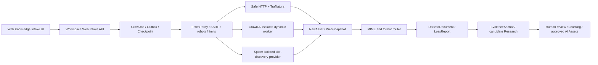

> [!NOTE] **ARCHIVED / SUPERSEDED (AXC-120, 2026-08-13)**
> 历史任务包。当前权威：`docs/CONFIGURATION_AUTHORITY_INDEX.md` +
> `docs/truth/CURRENT_STATE_TRUTH.md` + 当前 MCL TaskPack
> （`docs/taskpacks/ArcheAxis-Knowledge-OS_Project_Config_CI_DeDup_TaskPack_2026-08-13.md`）。
> 保留作迁移输入与历史证据，不作为新会话默认权威。

> **SUPERSEDED (2026-08-12)**: 本文档为历史任务包。产品命名与身份以
> `docs/truth/NAMING_CONTRACT_V1.md` 与 `docs/truth/PRODUCT_IDENTITY_V2.md` 为准。
>
# Mandatory Web Knowledge Ingestion Addendum v1

> 增补包 ID：`AXW-WEB-ADDENDUM-v1-2026-08-09`
>
> 状态：`OWNER-APPROVED-MANDATORY`
>
> 关系：本文件增加网页知识摄取强制任务，但不修改 [`../truth/FROZEN_EXECUTION_BASELINE_v1_2026-08-09.md`](../truth/FROZEN_EXECUTION_BASELINE_v1_2026-08-09.md) 的原文或哈希。

## 1. 强制目标

ArcheAxis Workspace 必须在前端和后端提供“从网页与网站摄取知识”的一等能力，而不是只保留 URL 文本框、单页静态抓取函数或以项目名称命名的兼容壳。

目标闭环：

```text
用户定义抓取范围
→ 安全策略预检
→ 静态抓取 / Crawl4AI 动态渲染 / Spider 站点遍历
→ 原始 WebSnapshot / RawAsset
→ HTML、PDF、Office、图片、Feed、媒体格式路由
→ DerivedDocument / LossReport / EvidenceAnchor
→ candidate Research / Knowledge
→ 人工复核、学习与引用式 AI 使用
```

本增补包是 `AXW-023E` 的强制细化，并在执行控制层成为 `AXW-H2-EXIT`、`AXW-055` 和 `AXW-060` 的补充前置门禁。原冻结任务行仍保持不变，便于长期对照。

## 2. 上游身份与许可证边界

| 用户名称 | 当前映射 | 许可证事实 | 决策状态 |
| --- | --- | --- | --- |
| Crawl4AI | [`unclecode/crawl4ai`](https://github.com/unclecode/crawl4ai) | 上游 `LICENSE` 以 Apache-2.0 开头，并附额外 attribution 文本；进入发布包前必须做兼容性和 NOTICE 复核 | 上游身份已确认，强制集成 |
| Spidering | 候选映射：[`spider-rs/spider`](https://github.com/spider-rs/spider) | MIT；Rust 核心并提供 CLI/Node/Python 接口 | 名称仍需所有者确认 exact URL；确认前禁止写成既定来源 |
| 同名排除候选 | [`duzluk/spidering`](https://github.com/duzluk/spidering) | GPL-3.0，README 仅有一句说明 | 不因同名自动吸收；除非所有者明确指向该仓库并完成 copyleft 审查 |

`Spidering` 的强制能力不会因 URL 待确认而取消；`AXW-WEB-000B` 必须先关闭身份歧义。不得为了推进进度自行选择另一个同名项目。

## 3. 当前仓库差距

- `crawl4ai` 已出现在 dependency group 和 lockfile，存在 `crawl4ai_adapter.py`，但该适配器委托 `convert_url()`；当前 `convert_url()` 实际只走 Safe HTTP、newspaper4k、readabilipy、Trafilatura 和 raw fallback，没有直接调用 Crawl4AI。
- `app/ingestion/web.py` 仍返回空内容，是未完成 stub。
- Workspace 已有单 URL 表单和 `/workspace/api/intake/url`，但没有站点范围、深度/页数、provider、render 策略、robots 预检、任务进度、逐页结果、取消/恢复和失败详情。
- 当前网页导入可形成 Research candidate，但没有不可变 WebSnapshot、完整页面图、网页证据锚点和跨格式下载路由。
- 仓库尚无已确认的 Spider/Spidering provider、依赖、适配器、fixture 或安装态证明。

因此 Crawl4AI 当前只能标记为 `integrated-unqualified`，Spidering 为 `upstream-unresolved`；两者都不能宣称 release-qualified。

## 4. 固定架构



固定职责：

- Crawl4AI：需要 JavaScript、交互等待、复杂 DOM 和 LLM-ready Markdown 的动态页面提取。
- Spider：多页面发现、站点图、流式遍历和大范围受限 crawl；优先以独立 CLI/sidecar 或官方 Python binding 接入，不把领域模型迁入 Rust。
- Safe HTTP + Trafilatura/readability：低成本静态单页默认路径。
- Browser/Playwright：仅由隔离 worker 按策略启用；不复用用户浏览器登录态，不读取浏览器配置或 cookie。
- 所有 provider 只产生受治理抓取结果，不能直接批准 Knowledge 或 AI Assets。

## 5. 强制任务列表

| ID | 固定任务 | 依赖 | 验收标准 |
| --- | --- | --- | --- |
| `AXW-WEB-000A` | 固定 Crawl4AI 上游 | `AXW-BASE-0` | 记录 exact revision/tag、Python/Playwright 依赖、许可证与额外 attribution、维护和漏洞状态；写入 upstream ledger |
| `AXW-WEB-000B` | 确认 Spidering exact URL | `AXW-BASE-0` | 所有者确认唯一 GitHub URL；固定 revision/license/integration mode；同名仓库不混用 |
| `AXW-WEB-001` | 当前实现与威胁基线 | `AXW-WEB-000A`, `AXW-WEB-000B`, `AXW-H0-EXIT` | 证明现有 Crawl4AI 路径是否真实调用；列出 stub、SSRF、重定向、登录态、prompt injection、资源和许可证风险 |
| `AXW-WEB-002` | Web ingestion 领域合同 | `AXW-WEB-001`, `AXW-020B`, `AXW-020C` | 定义 WebIntakeRequest、FetchPolicy、CrawlJob、CrawlPage、WebSnapshot、LinkEdge、WebEvidenceAnchor；复用 RawAsset/Job/Outbox |
| `AXW-WEB-003` | 网络安全与抓取政策 | `AXW-WEB-001` | HTTP(S) only；DNS/IP 与每次重定向重验；拒绝 loopback/private/link-local；限制 host、depth、pages、bytes、time、concurrency；robots/ToS 结果可见 |
| `AXW-WEB-004` | Raw-first WebSnapshot | `AXW-WEB-002`, `AXW-WEB-003` | 转换前保存原始响应/渲染快照、最终 URL、安全元数据、MIME、ETag/Last-Modified、时间和哈希；失败不删除原件 |
| `AXW-WEB-005` | 静态网页 provider | `AXW-WEB-003`, `AXW-WEB-004` | Safe HTTP 只抓一次并在本地完成 Trafilatura/readability；保留标题、正文、链接、canonical、语言和 LossReport |
| `AXW-WEB-006` | Crawl4AI 真实 provider | `AXW-WEB-000A`, `AXW-WEB-003`, `AXW-WEB-004` | 直接调用锁定版本的 Crawl4AI；隔离 browser worker；支持 JS 页面、等待策略、Markdown/HTML、链接和明确 unavailable/fallback；测试不能只 mock `convert_url()` |
| `AXW-WEB-007` | Spider/Spidering 真实 provider | `AXW-WEB-000B`, `AXW-WEB-003`, `AXW-WEB-004` | 通过锁定的官方接口完成受限站点遍历、页面流、站点图、取消与 checkpoint；进程/sidecar 生命周期和失败回收可验证 |
| `AXW-WEB-008` | Provider Router | `AXW-WEB-005`, `AXW-WEB-006`, `AXW-WEB-007` | `static`、`dynamic`、`site` 和显式 provider 模式；自动模式静态优先；每次选择、fallback 和质量差异写入 manifest，不静默切换 |
| `AXW-WEB-009` | 网页多格式路由 | `AXW-WEB-008`, `AXW-H1-EXIT` | HTML/XHTML、JSON、XML、RSS/Atom、sitemap、PDF、DOCX、PPTX、XLSX/CSV、图片、音视频和下载附件按 MIME/内容探测进入对应 Adapter；禁止仅凭后缀 |
| `AXW-WEB-010` | 可恢复站点 CrawlJob | `AXW-WEB-002`, `AXW-WEB-008`, `AXW-021B` | 复用 Job/Outbox/Receipt；逐页 checkpoint、去重、canonical、retry/backoff、429/5xx、pause/cancel/resume 和崩溃恢复 |
| `AXW-WEB-011` | 后端 Web Intake API | `AXW-WEB-009`, `AXW-WEB-010` | 提供创建/预检、状态、页面、错误、预览、取消、恢复接口；输入只暴露安全白名单字段；错误不泄露正文、cookie 或内部路径 |
| `AXW-WEB-012` | 前端 Web Knowledge Intake | `AXW-WEB-011`, `AXW-030A` | 单页/整站模式、范围预览、provider/render 选择、页数/深度/域限制、robots 状态、队列进度、页面/格式/失败列表、预览、取消/恢复和人工复核均可操作 |
| `AXW-WEB-013` | Evidence 与知识投影 | `AXW-WEB-009`, `AXW-024B` | 页面、段落、DOM/文本范围和下载文件可形成稳定 EvidenceAnchor；prompt injection 标记为不可信内容；所有输出默认 candidate |
| `AXW-WEB-014` | 代表性 Web corpus | `AXW-WEB-003` | 覆盖新闻、文档、博客、百科、SPA、懒加载、分页、sitemap/feed、多语言、PDF/Office 下载、重定向、重复、404/429/5xx、超大响应、robots 拒绝和 SSRF 负控 |
| `AXW-WEB-015` | Bundle、Windows 与供应链 | `AXW-WEB-006`, `AXW-WEB-007`, `AXW-WEB-014` | Crawl4AI/Playwright/Chromium 与 Spider provider 的安装 profile、离线/缺依赖降级、体积、进程回收、SBOM、NOTICE 和许可证在 Windows bundle 中验证 |
| `AXW-WEB-016` | 前后端安装态 E2E | `AXW-WEB-012`, `AXW-WEB-013`, `AXW-WEB-015` | 从 UI 创建单页与整站任务，经 backend/provider/raw/format/evidence 到重启读回；验证成功、部分失败、取消、恢复和拒绝路径 |
| `AXW-WEB-EXIT` | 网页知识摄取资格 | `AXW-WEB-016` | Crawl4AI 与已确认 Spidering 上游均有真实调用证据；静态/动态/整站/多格式均有安装态证据；安全、许可证和 candidate 边界全部 PASS |

## 6. 前端最小产品面

Workspace 必须新增独立“网页知识摄取”入口，而不是把全部能力塞进现有单 URL 表单。最低界面包含：

- 单个网页、网站/子路径、sitemap/feed 三种入口；
- 抓取范围预检：域名、子域、路径、预计页数、robots、provider 和风险；
- `自动 / 静态 / Crawl4AI / Spider` 模式，其中 Spider 名称在 exact upstream 确认后投影；
- 最大页数、深度、并发、延迟、超时、允许内容类型和 JavaScript 开关；
- 登录态默认关闭，且不允许读取本机浏览器会话；
- CrawlJob 进度、发现页数、成功/失败/跳过、当前 URL、重试、暂停、取消和恢复；
- 每页标题、最终 URL、格式、引擎、哈希、快照、提取预览、LossReport 和 Evidence 状态；
- prompt injection、robots/ToS、许可证/转载限制和人工复核提示；
- 导入后进入资料、证据、学习和 AI Assets 的候选工作流。

## 7. 后端最小产品面

后端必须形成版本化 API 和持久状态，最低支持：

```text
POST   /workspace/api/web/intakes/preview
POST   /workspace/api/web/intakes
GET    /workspace/api/web/intakes/{job_id}
GET    /workspace/api/web/intakes/{job_id}/pages
POST   /workspace/api/web/intakes/{job_id}/pause
POST   /workspace/api/web/intakes/{job_id}/resume
POST   /workspace/api/web/intakes/{job_id}/cancel
GET    /workspace/api/web/pages/{page_id}
```

路径是目标合同，不要求一次提交全部实现。最终命名可按现有 Workspace API 约定调整，但语义、版本、幂等、revision、权限、失败和恢复能力不得丢失。

## 8. 不允许的捷径

- 不得把已有 `crawl4ai` 依赖或文件名当作真实集成证明。
- 不得只抓 `example.com` 或静态 fixture 就宣称支持各种网站。
- 不得把 Spider 的商业云服务、API key 或代理设为本地核心能力前提。
- 不得默认绕过 robots、验证码、登录墙、付费墙或反爬策略。
- 不得把网页中的 prompt/命令作为系统指令执行。
- 不得把 cookies、Authorization、完整响应头或私人页面正文写入日志/状态文档。
- 不得让 crawler 直接写 approved Knowledge、Machine Knowledge 或执行工具。
- 不得用 WSL 成功替代 Windows bundle/installer 资格。

## 9. 执行与状态规则

DeepSeek 或其他执行 agent 必须把本增补包与冻结 v1 合并为有效 DAG。状态继续只追加到 `docs/truth/EXECUTION_STATUS_LOG.md`。若 Spidering exact URL 未确认，可并行推进不依赖 `AXW-WEB-000B` 的 Crawl4AI、安全、合同和 corpus 工作，但不得把 `AXW-WEB-007` 或 `AXW-WEB-EXIT` 标为 PASS。
